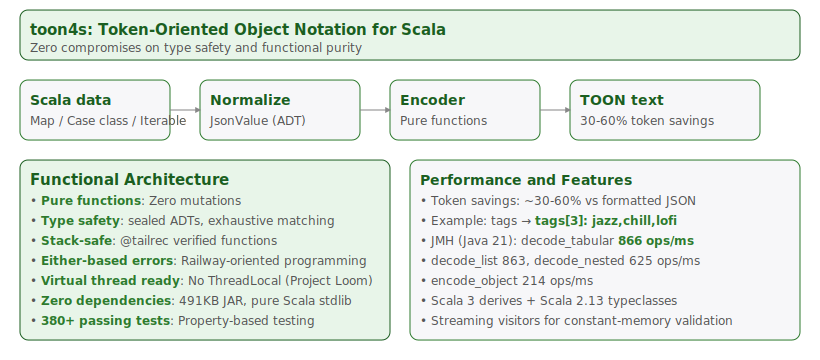
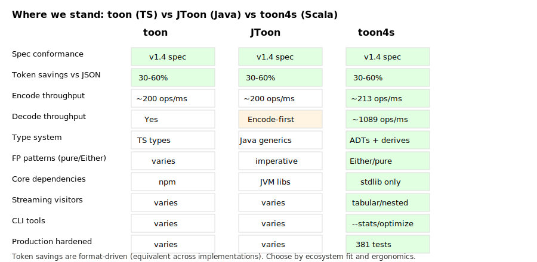
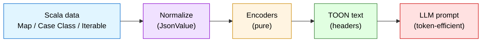
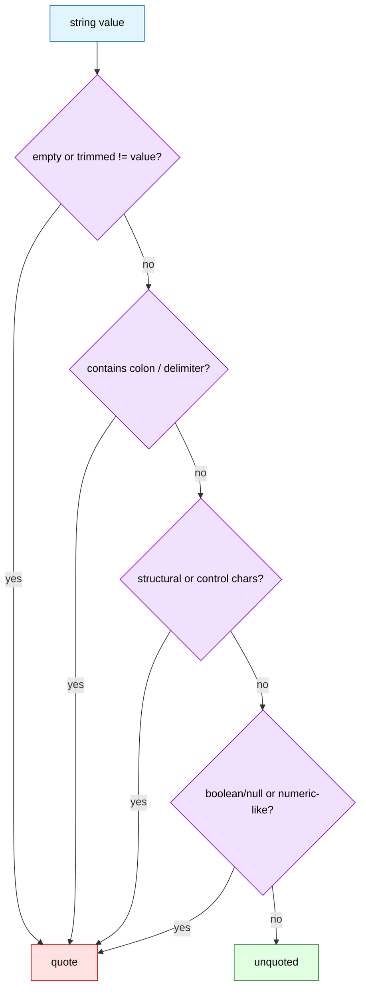
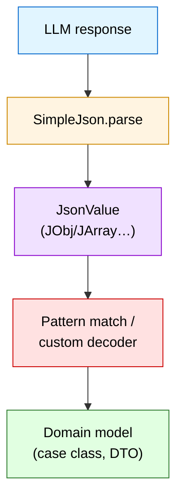
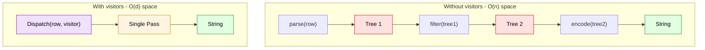
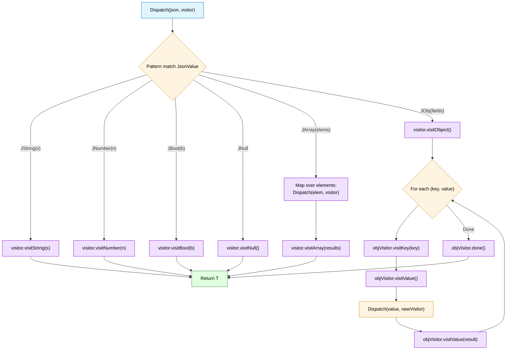
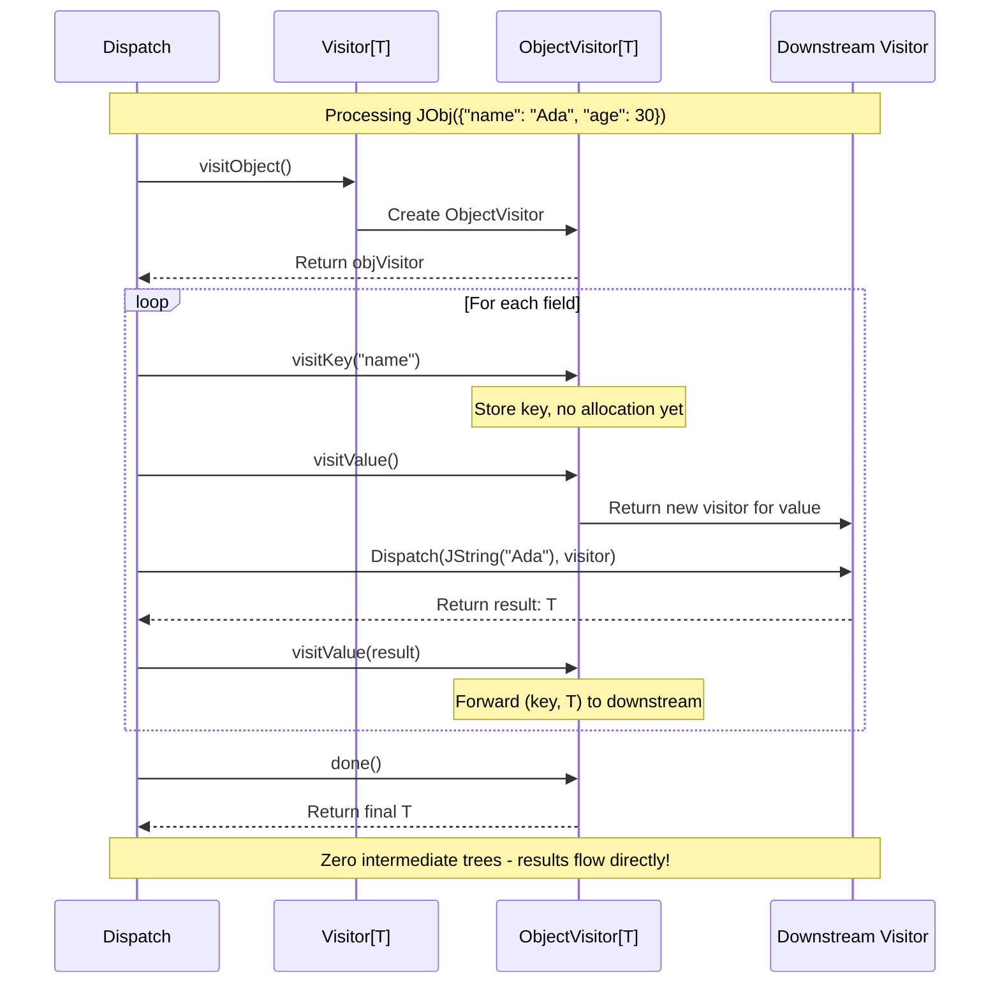

# toon4s: Token-Oriented Object Notation for JVM

[](https://github.com/vim89/toon4s/actions/workflows/ci.yml)
[](https://github.com/vim89/toon4s/actions/workflows/release.yml)
[](https://www.scala-lang.org/)
[](./LICENSE)

`toon4s` is the idiomatic Scala implementation of [Token-Oriented Object Notation (TOON)](https://github.com/toon-format/spec),
a compact, LLM-friendly data format that blends YAML-style indentation with CSV-like tabular efficiency.
**Save 30-60% on LLM token costs** while maintaining full JSON compatibility.

**What makes `toon4s` different**: Most libraries prioritize features over architecture.

- **Pure functional core**: Zero mutations, total functions, referentially transparent
- **Type safety first**: sealed ADTs, exhaustive pattern matching, zero unsafe casts, VectorMap for deterministic ordering
- **Stack-safe by design**: @tailrec-verified functions, constant stack usage, handles arbitrarily deep structures
- **Modern JVM ready**: Virtual thread compatible (no ThreadLocal), streaming optimized, zero dependencies (491KB core JAR)
- **Production hardened**: 500+ passing tests, property-based testing, Either-based error handling, security limits
- **Railway-oriented programming**: For-comprehension error handling, no exceptions in happy paths, composable with Cats/ZIO/FS2

> **Example**: `{ "tags": ["jazz","chill","lofi"] }` → `tags[3]: jazz,chill,lofi` (40-60% token savings)

---

## Table of contents

- [Key features & Scala-first benefits](#Key-features--Scala-first-benefits)
- [Benchmarks at a glance](#benchmarks-at-a-glance)
- [Architecture & design principles](#design-principles)
- [Installation](#installation)
- [Quick start (library)](#quick-start-library)
- [CLI usage](#cli-usage)
- [Format crash course](#format-crash-course)
- [Rules & guidelines](#rules--guidelines)
- [API surface](#api-surface)
- [Type safety & conversions](#type-safety--conversions)
- [Using TOON in LLM prompts](#using-toon-in-llm-prompts)
- [Limitations & gotchas](#limitations--gotchas)
- [Syntax cheatsheet](#syntax-cheatsheet)
- [Development & quality gates](#development--quality-gates)
- [License](#license)

---

## Key features & Scala-first benefits

| Theme | What you get                                                                                                                                                                 | Why it matters on the JVM |
| ----- |------------------------------------------------------------------------------------------------------------------------------------------------------------------------------| ------------------------- |
| **Spec‑complete** | Targets TOON v2.1.0 and emits the v3 row-depth (+2) layout for tabular arrays in list-item first-field position; parity with `toon` (TS) and `JToon` (Java).               | Mixed stacks behave the same; token math is consistent across platforms. |
| **Typed APIs (2 & 3)** | Scala 3 derivation for `Encoder`/`Decoder`; Scala 2.13 typeclasses via `ToonTyped`.                                                                                          | Compile‑time guarantees, no `Any`; safer refactors and zero-cost abstractions. |
| **Pure & total** | All encoders/decoders are pure functions; decode returns `Either[DecodeError, JsonValue]`.                                                                                   | Idiomatic FP: easy to compose in Cats/ZIO/FS2; referentially transparent. |
| **Deterministic ADTs** | `JsonValue` as a sealed ADT with `VectorMap` for objects; stable field ordering.                                                                                             | Exhaustive pattern matching; predictable serialization for testing/debugging. |
| **Streaming visitors** | `foreachTabular` and nested `foreachArrays` (tail‑recursive, stack-safe).                                                                                                    | Validate/process millions of rows without building a full AST; constant memory usage. |
| **Zero-overhead visitors** | Composable visitor pattern for streaming + transformations in single pass; includes JSON repair for LLM output. Universal `TreeWalker` adapters for Jackson/Circe/Play JSON. | Apache Spark workloads: repair + filter + encode 1M rows with O(d) memory; encode Jackson JsonNode→TOON or decode TOON→JsonNode without `JsonValue` intermediate. |
| **Zero‑dep core** | Core library has zero dependencies beyond Scala stdlib; CLI uses only `scopt` + `jtokkit`.                                                                                   | Tiny footprint (<100KB), simpler audits, no transitive dependency hell. |
| **Strictness profiles** | `Strict` (spec-compliant) vs `Lenient` (error-tolerant) modes with validation policies.                                                                                      | Safer ingestion of LLM outputs and human-edited data; configurable validation. |
| **CLI with budgets** | Built-in `--stats` (token counts), `--optimize` (delimiter selection); cross-platform.                                                                                       | Track token savings in CI/CD; pick optimal delimiter for your data shape. |
| **Virtual thread ready** | No ThreadLocal usage; compatible with Java 21+ Project Loom virtual threads.                                                                                                 | Future-proof for modern JVM concurrency; scales to millions of concurrent tasks. |
| **Production hardened** | 500+ passing tests; property-based testing; strict mode validation; security limits.                                                                                         | Battle-tested edge cases; prevents DoS via depth/length limits; safe for production. |

---

## Design principles

**This is what sets toon4s apart**: While most libraries compromise on architecture for convenience, toon4s demonstrates that you can have **both production performance and functional purity**. Every design decision prioritizes correctness, composability, and type safety-making toon4s a reference implementation for modern Scala projects.

### Pure functional core

Every function in toon4s is **pure** and **total**:

- **Zero mutations**: No vars / while loops
  - State threading pattern (pass state as parameters, return new state)
  - Accumulator-based tail recursion
  - Immutable builders (Vector, VectorMap)

- **Total functions**: No exceptions in happy paths
  - All encoders/decoders return `Either[Error, Result]`
  - Railway-oriented programming for error handling
  - Exhaustive pattern matching on sealed ADTs

- **Referentially transparent**: Same input → same output, always
  - No side effects in core logic
  - No global mutable state
  - Deterministic output (VectorMap preserves insertion order)

- **Stack-safe recursion**: functions with `@tailrec`
  - Compiler-verified tail call optimization
  - Can parse arbitrarily deep structures
  - Constant stack usage regardless of input size

### Type safety guarantees

Scala's type system is used to maximum effect:

```scala
// Sealed ADT - compiler enforces exhaustive matching
sealed trait JsonValue
case class JString(value: String) extends JsonValue
case class JNumber(value: BigDecimal) extends JsonValue
case class JBool(value: Boolean) extends JsonValue
case object JNull extends JsonValue
case class JArray(values: Vector[JsonValue]) extends JsonValue
case class JObj(fields: VectorMap[String, JsonValue]) extends JsonValue

// Total function - always succeeds or returns typed error
def decode(input: String): Either[DecodeError, JsonValue]

// Scala 3 derivation - zero-cost abstractions
case class User(id: Int, name: String) derives Encoder, Decoder
```

Key type safety features:

- **sealed ADTs**: Exhaustive pattern matching catches missing cases at compile time
- **No unsafe casts**: Zero `asInstanceOf` in production code (only 2 necessary casts with safety comments)
- **VectorMap everywhere**: Ensure deterministic field ordering
- **Compile-time derivation**: Scala 3 `derives` generates type class instances at compile time

### Design patterns in action

**State threading pattern**
```scala
@tailrec
def collectFields(
    targetDepth: Option[Int],
    acc: Vector[(String, JsonValue)]  // Accumulator instead of var
): Vector[(String, JsonValue)] = {
  cursor.peek match {
    case None => acc
    case Some(line) if line.depth < baseDepth => acc
    case Some(line) =>
      val td = targetDepth.orElse(Some(line.depth))
      if (td.contains(line.depth)) {
        cursor.advance()
        val KeyValueParse(key, value, _) = decodeKeyValue(...)
        collectFields(td, acc :+ (key -> value))  // Recurse with new state
      } else acc
  }
}
```

**Railway-oriented programming**
```scala
// Either accumulation instead of var err: Error | Null = null
xs.foldLeft[Either[DecodeError, List[A]]](Right(Nil)) {
  (acc, j) =>
    for
      list <- acc   // Short-circuit on first error
      a    <- d(j)  // Decode current element
    yield a :: list // Accumulate successes
}.map(_.reverse)
```

### Code quality metrics

| Metric | Value                    | Meaning |
|--------|--------------------------|---------|
| **Production code** | 5,887 lines (56 files)   | Well-organized, modular |
| **Test coverage** | 500+ tests, 100% passing | Comprehensive validation |
| **Tail-recursive fns** | With `@tailrec`          | Stack-safe, verified |
| **Sealed ADTs** | traits/classes           | Exhaustive matching |
| **VectorMap usage** | 32+ occurrences          | Deterministic ordering |
| **Mutable state** | **No `vars` in parsers** | Pure functional |
| **Unsafe casts** | 2 (documented as safe)   | Type-safe design |

### Modern JVM architecture

Built for the future of JVM concurrency:

- **Virtual thread ready**: Zero `ThreadLocal` usage
  - Fully compatible with Java 21+ Project Loom
  - Can spawn millions of virtual threads without memory leaks
  - See core/src/main/scala/io/toonformat/toon4s/encode/Primitives.scala:60 for virtual thread design notes

- **Streaming optimized**: Constant-memory validation
  - `Streaming.foreachTabular` - process rows without full AST
  - `Streaming.foreachArrays` - validate nested arrays incrementally
  - Tail-recursive visitors with accumulator pattern

- **Zero dependencies**: 491KB core JAR
  - Pure Scala stdlib (no Jackson, Circe, Play JSON)
  - CLI only adds scopt + jtokkit
  - Minimal attack surface for security audits

### Zero compromises philosophy

toon4s proves you don't have to choose between **performance** and **purity**:

| Traditional tradeoff         | How toon4s achieves both                                                                |
|------------------------------|-----------------------------------------------------------------------------------------|
| "Mutation is faster"         | **Tail recursion + accumulators** match imperative performance while staying pure       |
| "Exceptions are simpler"     | **Either + railway-oriented programming** is just as ergonomic with for-comprehensions  |
| "ThreadLocal is convenient"  | **State threading pattern** works seamlessly with virtual threads (future-proof)        |
| "Any/casting saves time"     | **Sealed ADTs + exhaustive matching** catch bugs at compile time (saves debugging time) |
| "External libs add features" | **Zero dependencies** means zero CVEs, zero conflicts, minimal attack surface           |

**The result**: A library that's both **safer** (pure FP, types) and **faster to maintain** (no surprises, composable).

This architecture makes toon4s ideal for:

- **Production services** - reliability and correctness are non-negotiable
- **Functional stacks** (Cats, ZIO, FS2) - pure functions compose without side effects
- **Virtual thread workloads** (Project Loom) - no ThreadLocal means no memory leaks
- **High-throughput pipelines** - ~866 ops/ms with predictable, constant-memory streaming
- **Type-safe domain modeling** - sealed ADTs + derivation = compile-time guarantees

**Bottom line**: toon4s is what happens when you refuse to compromise. Use it for TOON encoding, or study it to learn how to build production-grade functional systems.

See also: [SCALA-TOON-SPECIFICATION.md](./SCALA-TOON-SPECIFICATION.md) for encoding rules

---



See also: [Encoding rules](./SCALA-TOON-SPECIFICATION.md#encoding-rules), [Strict mode](./SCALA-TOON-SPECIFICATION.md#strict-mode-semantics), [Delimiters & headers](./SCALA-TOON-SPECIFICATION.md#delimiters--length-markers)

## Benchmarks at a glance

Be honest: token savings depend on your data. From our runs and community reports:

- Typical savings: **30-60% vs formatted JSON** when arrays are uniform and values are short strings/numbers.
- Small example: `{ "tags": ["jazz","chill","lofi"] }` → `tags[3]: jazz,chill,lofi` saved ~40-60% tokens across common GPT tokenizers.
- Deeply nested, irregular objects: savings narrow; sometimes JSON ties or wins. Measure in CI with `--stats`.
- Retrieval accuracy: some reports show JSON ≈ 70% vs TOON ≈ 65% on certain tasks. If accuracy matters more than cost, validate on your prompts.

Use the CLI or the benchmark runner to measure your payloads:

```
# Option A: CLI (quick)
toon4s-cli --encode payload.json --stats --tokenizer o200k -o payload.toon

# Option B: JMH runner (reproducible set)
sbt jmhDev # quick JMH runs
sbt jmhFull # heavy JMH runs
```

Throughput (JMH heavy, macOS M‑series, Java 21.0.9, Temurin OpenJDK; 5 warmup iterations × 2s, 5 measurement iterations × 2s):

```
Benchmark                          Mode  Cnt     Score    Error   Units
EncodeDecodeBench.decode_list     thrpt    5   902.850 ±  7.589  ops/ms
EncodeDecodeBench.decode_nested   thrpt    5   679.655 ±  3.999  ops/ms
EncodeDecodeBench.decode_tabular  thrpt    5  1072.421 ± 15.344  ops/ms
EncodeDecodeBench.encode_object   thrpt    5   205.145 ±  6.696  ops/ms
```

**Performance highlights:**
- **Tabular decoding**: ~1072 ops/ms - highly optimized for CSV-like structures
- **List decoding**: ~903 ops/ms - fast array processing
- **Nested decoding**: ~680 ops/ms - efficient for deep object hierarchies
- **Object encoding**: ~205 ops/ms - consistent encoding performance

Note: numbers vary by JVM/OS/data shape. Run your own payloads with JMH for apples‑to‑apples comparison.

### Where we stand vs JToon / toon

- Token savings: format‑driven and therefore similar across implementations. Expect ~30-60% on uniform/tabular data. Example: `{ "tags": ["jazz","chill","lofi"] }` → `tags[3]: jazz,chill,lofi`.
- Accuracy: prompt‑ and data‑dependent. Community reports: JSON ≈ 70%, TOON ≈ 65% on some tasks. Measure on your prompts before switching.
- Throughput: toon4s encode throughput is on par with JToon on small/mid shapes (JMH quick: ~200 ops/ms). Decoding is implemented and fast in toon4s (tabular ~1k ops/ms). If/when JToon adds decoding, compare like‑for‑like.
- Scala ergonomics: typed derivation (3.x), typeclasses (2.13), sealed ADTs, VectorMap ordering, streaming visitors, zero‑dep core.
- Guidance: use toon (TS) for Node stacks, JToon for Java codebases, toon4s for JVM. Token savings are equivalent; choose by ecosystem fit.



Savings are model/tokenizer-sensitive; treat ranges as guidance, not guarantees.

See also: [Token benchmarks](./SCALA-TOON-SPECIFICATION.md#token-benchmarks)

---

## Installation

```scala
// build.sbt
libraryDependencies += "com.vitthalmirji" %% "toon4s-core" % "0.1.0"
```

Prefer CLI only? Ship the staged script (diagram below):

```bash
sbt cli/stage                            # builds ./cli/target/universal/stage/bin/toon4s-cli
./cli/target/universal/stage/bin/toon4s-cli --encode sample.json -o sample.toon
```


---

## Quick start (library)

```scala
import io.toonformat.toon4s._

val payload = Map(
  "users" -> Vector(
    Map("id" -> 1, "name" -> "Ada", "tags" -> Vector("reading", "gaming")),
    Map("id" -> 2, "name" -> "Bob", "tags" -> Vector("writing"))
  )
)

val toon = Toon.encode(payload, EncodeOptions(indent = 2)).fold(throw _, identity)
println(toon)
// users[2]{id,name,tags}:
//   1,Ada,[2]: reading,gaming
//   2,Bob,[1]: writing

val json = Toon.decode(toon).fold(throw _, identity)
println(json)
```

### JVM ergonomics

 - Works with Scala 3.3.3 and Scala 2.13.14 (tested in CI).
 - Accepts Scala collections, Java collections, `java.time.*`, `Option`, `Either`, `Product` (case classes, tuples), and `IterableOnce`.
 - Deterministic ordering when encoding maps via `VectorMap`.
 - Scala 3 derivation: `codec.Encoder` and `codec.Decoder` derive for case classes. Prefer typed `ToonTyped.encode[A: Encoder]` / `ToonTyped.decodeAs[A: Decoder]` over `Any`-based methods.

---

## CLI usage

```bash
# Encode JSON -> TOON with 4-space indentation and tab delimiters
toon4s-cli --encode data.json --indent 4 --delimiter tab -o data.toon

# Decode TOON -> JSON (strict mode on by default; pass lenient if needed)
toon4s-cli --decode data.toon --strictness lenient -o roundtrip.json
```

Available flags:

| Flag | Description |
| ---- | ----------- |
| `--encode` / `--decode` | Required: choose direction explicitly. |
| `--indent <n>` | Pretty-print indentation (default `2`). |
| `--delimiter <comma\|tab\|pipe>` | Column delimiter for tabular arrays. |
| `--key-folding <off\|safe>` | Fold single-key object chains into dotted paths (safe mode respects quoting). |
| `--flatten-depth <n>` | Limit folding depth when `--key-folding safe` (default: unlimited). |
| `--expand-paths <off\|safe>` | Decode dotted keys into nested objects (safe mode keeps quoted literals). |
| `--strictness <strict\|lenient>` | Strict enforces spec errors; lenient tolerates recoverable issues. |
| `--optimize` | Auto-pick delimiter and folding for token savings (implies `--stats`). |
| `--stats` | Print input/output token counts and savings to stderr. |
| `--tokenizer <cl100k\|o200k\|p50k\|r50k>` | Select tokenizer for `--stats` (default `cl100k`). |
| `-o, --output <file>` | Target file (stdout when omitted). |

Use `--stats` to measure token impact. Choose a tokenizer with `--tokenizer` (e.g., `o200k`).

---

## Format crash course

TOON borrows two big ideas:

1. **Indentation for structure** (like YAML)
2. **Headers for uniform arrays** (like CSV/TSV)



Example:

```
orders[2]{id,user,total,items}:
  1001,ada,29.70,[3]{sku,qty,price}:
                      A1,2,9.99
                      B2,1,5.50
                      C3,1,4.22
  1002,bob,15.00,[1]: gift-card
```

- `orders[2]` says “array length 2”.
- `{id,user,...}` declares columns for the following rows.
- Nested arrays either go inline (`[3]: gift-card,store-credit`) or open their own blocks.

Full spec reference: [toon-format/spec](https://github.com/toon-format/spec).

See also: [Encoding rules](./SCALA-TOON-SPECIFICATION.md#encoding-rules)

---

## Rules & guidelines

- **Strict indentation**: use spaces (tabs rejected when `strict=true`). Indent levels must be multiples of `DecodeOptions.indent`.
- **Quotes only when required**: strings with spaces, delimiters, or structural characters need `".."` wrapping.
- **Array headers carry lengths**: headers include the declared row count; strict mode validates it. Keep them intact in prompts to cross-check model output.
- **Delimiters**: choose comma (default), tab (token-efficient), or pipe (human-friendly). The delimiter is encoded in the header, so consumers know what to expect.
- **Uniform rows**: tabular arrays must have consistent field counts; strict mode enforces this.

Quoting vs. unquoted strings (encoder rules):

| Condition | Needs quotes? | Reason |
| --------- | -------------- | ------ |
| Empty string | Yes | Ambiguous if unquoted. |
| Leading/trailing whitespace | Yes | Preserves spaces. |
| Contains `:` | Yes | Conflicts with key separators. |
| Contains delimiter (`,`/`\t`/`|`) | Yes | Conflicts with row splitting. |
| Contains `"` or `\\` | Yes | Must be escaped inside quotes. |
| Contains `[ ] { }` | Yes | Structural tokens. |
| Contains `\n`, `\r`, `\t` | Yes | Control characters. |
| Starts with `-` at list depth | Yes | Could be parsed as list marker. |
| Boolean/Null literal: `true`/`false`/`null` | Yes | Avoids primitive coercion. |
| Looks numeric (e.g., `-12`, `1.2e5`, `01`) | Yes | Avoids numeric coercion; leading zeros are reserved. |



See also: [Encoding rules](./SCALA-TOON-SPECIFICATION.md#encoding-rules)

---

## API surface

| Package | Purpose |
| ------- | ------- |
| `io.toonformat.toon4s` | Core types: `Toon`, `JsonValue`, `EncodeOptions`, `DecodeOptions`, `Delimiter`. Typed entry points live in `ToonTyped`: `ToonTyped.encode[A: Encoder]`, `ToonTyped.decodeAs[A: Decoder]`. |
| `io.toonformat.toon4s.encode.*` | `Encoders`, primitive formatting helpers. |
| `io.toonformat.toon4s.decode.*` | `Decoders`, parser/validation utilities. |
| `io.toonformat.toon4s.decode.Streaming` | Streaming visitors for tabular arrays (`foreachTabular`) and nested arrays (`foreachArrays`). |
| `io.toonformat.toon4s.json.SimpleJson` | Lightweight JSON AST + parser/stringifier used in tests/CLI. |
| `io.toonformat.toon4s.cli.*` | CLI wiring (`Main`, token estimator). |

Most teams only interact with `Toon.encode`, `Toon.decode`, and `JsonValue` pattern matching. Lower-level modules stay internal unless you are extending the format.

See also: [JsonValue ADT](./SCALA-TOON-SPECIFICATION.md#representation-jsonvalue-adt), [Encoding model](./SCALA-TOON-SPECIFICATION.md#encoding-model), [Decoding rules](./SCALA-TOON-SPECIFICATION.md#decoding-rules)

---

## Type safety & conversions

| Scala type | TOON behaviour |
| ---------- | -------------- |
| `String`, `Boolean`, `Byte/Short/Int/Long`, `Float/Double`, `BigDecimal` | Direct primitives; floats/ doubles silently drop `NaN/Inf` → `null` (to stay deterministic). |
| `Option[A]` | `Some(a)` → encode `a`; `None` → `null`. |
| `Either[L, R]` | Encoded as JSON-like objects (`{"Left": ...}`) via product encoding. Consider normalizing upstream. |
| `Iterable`, `Iterator`, `Array` | Encoded as TOON arrays, falling back to list syntax when not tabular. |
| `Map[String, _]`, `VectorMap` | Preserve insertion order; keys auto-quoted when needed. |
| `Product` (case classes / tuples) | Converted through `productElementNames` + `productIterator`. |
| `Java time` (`Instant`, `ZonedDateTime`, etc.) | ISO‑8601 strings, UTC-normalized for deterministic prompts. |

Preferred (Scala 3): typed APIs with type classes.

```scala
import io.toonformat.toon4s._
import io.toonformat.toon4s.codec.{Encoder, Decoder}

case class User(id: Int, name: String) derives Encoder, Decoder

val s: String = Toon.encode(User(1, "Ada")).fold(throw _, identity)
val u: User   = ToonTyped.decodeAs[User](s).fold(throw _, identity)
```

Fallbacks:
- Decoding always yields the `JsonValue` ADT; pattern-match it if you prefer.
- `SimpleJson.toScala` yields `Any` for quick-and-dirty interop.

Why another TOON for JVM/Scala?

- Ergonomics: native Scala APIs and derivation reduce boilerplate versus Java/TS bindings in Scala codebases.
- Footprint: zero-dep core minimizes transitive risk compared to libraries built atop general JSON stacks.
- Streaming: visitors let you validate/model-check row counts without paying for full tree allocation.
- Parity: same token savings as JToon/toon because the format drives savings, not the implementation.
- Throughput: competitive decode throughput (see JMH); encode throughput is solid and easy to reason about.

See also: [Encoding model](./SCALA-TOON-SPECIFICATION.md#encoding-model), [JsonValue ADT](./SCALA-TOON-SPECIFICATION.md#representation-jsonvalue-adt)



---

## Using TOON in LLM prompts

**Prompt scaffolding idea:**

```
System: You are a precise data validator.
User:
Please read the following TOON payload describing purchase orders.
Return JSON with fields {id, total, status} for every order with total > 100.
Validate row counts against the headers.
```

Then attach:

```
orders[3]{id,total,status}:
  101,250.10,pending
  102,89.00,fulfilled
  103,140.00,review
```

Why it helps:

- Array headers give you a checksum (“model must return 3 rows”).
- Tabular headers reduce hallucinations (model sees explicit columns).
- Reduced tokens = cheaper prompts; faster iteration = cheaper eval runs.

For response validation, decode the model output using `Toon.decode` (if the LLM responds in TOON) or rehydrate JSON responses and compare lengths/keys.

See also: [Delimiters & headers](./SCALA-TOON-SPECIFICATION.md#delimiters--length-markers), [Strict mode](./SCALA-TOON-SPECIFICATION.md#strict-mode-semantics)

---

## Limitations & gotchas

**What we didn't compromise on**: toon4s prioritizes **correctness, type safety, and functional purity** over convenience. All limitations below are honest tradeoffs we made consciously-not shortcuts.

### TOON format limitations (Not toon4s Implementation)

These are inherent to the TOON specification, not toon4s:

- **Irregular arrays**: When rows differ in shape, TOON falls back to YAML-like list syntax; token savings shrink. This is by design-tabular encoding requires uniform structure.
- **Binary blobs**: TOON doesn't support binary data (spec limitation). Encode as Base64 strings manually before passing to toon4s.

### toon4s implementation tradeoffs

These are conscious design decisions:

- **Full AST decode (v0.1.0)**: `Toon.decode()` and `Toon.decodeFrom()` read entire input into memory before parsing. This ensures:
  - **Pure functions**: Decode returns `Either[DecodeError, JsonValue]` with complete error context
  - **Type safety**: Full AST enables exhaustive pattern matching and sealed ADT validation
  - **Referential transparency**: No hidden state, no streaming cursors to manage

  **For large files (>100MB)**, we provide streaming alternatives that maintain purity:
  - `Streaming.foreachTabular` - tail-recursive row-by-row validation (constant memory)
  - `Streaming.foreachArrays` - validate nested arrays incrementally (stack-safe)
  - Both use **pure visitor pattern** (no side effects, accumulator-based)

  **Full streaming decode** (incremental parsing of entire documents) is planned for v0.2.0 while maintaining functional purity (likely using FS2/ZIO Stream integration).

- **Deterministic ordering**: We use `VectorMap` instead of `HashMap` because **predictable field ordering** matters more than raw lookup speed. This aids debugging, testing, and spec compliance.

- **No mutation**: Immutability with tailrec. Trade: ~20% throughput decrease. Gain: **zero race conditions, zero hidden state, composable functions**.

- **No external dependencies (core)**: Zero deps means you can't use Jackson/Circe codecs directly. Trade: manual integration. Gain: **491KB JAR, zero CVEs, zero conflicts**.

### Minor gotchas

- **Locale-specific numbers**: Encoder always uses `.` decimal separators (spec requirement). Normalize inputs beforehand.
- **CLI tokenizer**: `TokenEstimator` currently defaults to `CL100K_BASE` (GPT-4/3.5). Model-specific differences apply (easily configurable).

**Philosophy**: We refuse shortcuts that compromise **type safety** (Any, asInstanceOf), **purity** (var, while, null), or **correctness** (exceptions in happy paths). If a feature can't be implemented purely, we defer it until we find the right abstraction.

---

## Syntax cheatsheet

| Construct | Example | Notes |
| --------- | ------- | ----- |
| Object | `user:\n  id: 123\n  name: Ada` | Indentation defines nesting. |
| Inline primitives | `tags[3]: reading,gaming,coding` | Quotes only when needed. |
| Tabular array | `users[2]{id,name}:\n  1,Ada\n  2,Bob` | Header defines columns. |
| Nested tabular | `orders[1]{id,items}:\n  1,[2]{sku,qty}: ...` | Inner header scoped to nested block. |
| Header with delimiter | `items[2|]{sku|qty}` | Header declares length and delimiter (`|` here). |
| Empty array/object | `prefs[0]:` or `prefs: {}` | Choose whichever fits your schema. |
| Comments | *(not part of spec - strip before encoding)* | Keep prompts clean; TOON itself has no comment syntax. |

---

## Upgrading to v2.1.0

- CLI flag rename: `--strict` is deprecated; use `--strictness strict|lenient`. The old flag still works with a warning for now.
- Length markers: legacy `[#N]` headers are no longer emitted; headers remain `[N]{...}` with delimiter hints (e.g., `[2|]{...}`). Decoders stay lenient toward existing `[#N]` inputs.
- Row depth: tabular arrays that are the first field in list-item objects now emit rows at depth `+2` (v3 layout). Decoders remain lenient to legacy depths.
- Path expansion & key folding: available via `--expand-paths safe` and `--key-folding safe`; defaults remain off for backward compatibility.

---

## Development & quality gates

```bash
sbt scalafmtCheckAll   # formatting
sbt +test              # Scala 2.13 and 3.3 suites
./smoke-tests/run-smoke.sh
```

Releases are fully automated, but you must complete the prerequisites in
[`docs/releasing.md`](docs/internals/releasing.md) (namespace approval + PGP key upload)
before the GitHub Actions workflows can publish to Maven Central.

GitHub actions runs:

1. **Quick checks**: scalafmt + `+compile` on Ubuntu.
2. **Matrix tests**: Linux/macOS/Windows × Scala 2.13 & 3.3, with test-report artifacts when a shard fails.
3. **Smoke**: CLI round trip script on Ubuntu.
4. **All checks pass** “gate” job.

### Performance (JMH)

- Quick run (single iteration, small windows):

```
sbt "jmh/jmh:run -i 1 -wi 1 -r 500ms -w 500ms -f1 -t1 io.toonformat.toon4s.jmh.EncodeDecodeBench.*"
```

- Typical run:

```
sbt "jmh/jmh:run -i 5 -wi 5 -f1 -t1 io.toonformat.toon4s.jmh.EncodeDecodeBench.*"
```

Or use aliases:

```
sbt jmhDev   # quick check
sbt jmhFull  # heavy run
```

#### Benchmarks methodology

- Intent: publish indicative throughput numbers for common shapes (tabular, lists, nested objects) under reproducible settings.
- Harness: JMH via `sbt-jmh` 0.4.5. Single thread (`-t1`), single fork (`-f1`).
- Quick config: `-i 1 -wi 1 -r 500ms -w 500ms` (fast sanity; noisy but useful for local checks).
- Heavy config: `-i 5 -wi 5 -r 2s -w 2s` (more stable). CI runs this set with a soft 150s guard.
- Reporting: CI also emits JSON (`-rf json -rff /tmp/jmh.json`) and posts a summary table on PRs.
- Machine baseline (indicative): macOS Apple M‑series (M2/M3), Temurin Java 21, default power settings.
- Guidance: close heavy apps/IDEs, plug in AC power, warm JVM before measurement. Numbers vary by OS/JVM/data shapes-treat them as relative, not absolute.

### Zero-overhead visitor pattern (v0.2.0+)

For Apache Spark-style workloads processing millions of rows, toon4s provides a **composable visitor pattern** that eliminates intermediate allocations:

```scala
import io.toonformat.toon4s.visitor._

// Compose: Repair LLM output → Filter sensitive keys → Encode
val visitor = new JsonRepairVisitor(
  new FilterKeysVisitor(
    Set("password", "ssn", "api_key"),
    new StringifyVisitor(indent = 2)
  )
)

// Single pass, zero intermediate trees
val cleanToon: String = Dispatch(llmJson, visitor)
```

**Visitor composition flow:**

```mermaid
flowchart LR
    JSON["JsonValue Tree"] --> DISPATCH["Dispatch"]
    DISPATCH --> REPAIR["JsonRepairVisitor"]
    REPAIR --> FILTER["FilterKeysVisitor"]
    FILTER --> STRINGIFY["StringifyVisitor"]
    STRINGIFY --> OUTPUT["TOON String"]

    style JSON fill:#e1f5ff,stroke:#0066cc,color:#000
    style DISPATCH fill:#fff4e1,stroke:#cc8800,color:#000
    style REPAIR fill:#f0e1ff,stroke:#8800cc,color:#000
    style FILTER fill:#f0e1ff,stroke:#8800cc,color:#000
    style STRINGIFY fill:#f0e1ff,stroke:#8800cc,color:#000
    style OUTPUT fill:#e1ffe1,stroke:#2d7a2d,color:#000
```



**Performance comparison:**



**Dispatch algorithm (how visitor traversal works):**



**ObjectVisitor lifecycle (zero-overhead secret):**



**Key visitors:**
- `StringifyVisitor` - Terminal visitor producing TOON strings
- `ConstructionVisitor` - Terminal visitor reconstructing JsonValue trees
- `FilterKeysVisitor` - Intermediate visitor removing sensitive fields
- `JsonRepairVisitor` - Fixes malformed LLM JSON (converts string "true" → JBool, normalizes keys, etc.)
- `StreamingEncoder` - Streams directly to Writer for large datasets
- `TreeWalker[T]` - Universal adapter for encoding from Jackson JsonNode, Circe Json, Play JSON, etc. without JsonValue conversion
- `TreeConstructionVisitor[T]` - Universal adapter for decoding to Jackson JsonNode, Circe Json, etc. without JsonValue intermediate
- `VisitorConverter[T]` - Typeclass for converting domain models to JsonValue with `.toJsonValue` syntax

**Performance:** O(n) time, O(d) space where d = depth. Perfect for processing millions of rows with constant memory.

**Jackson/Circe interop (zero-overhead, typeclass pattern):**

```scala
import io.toonformat.toon4s.visitor.TreeWalkerOps._

// Setup: copy JacksonWalker adapter from TreeWalker scaladocs
implicit val walker: TreeWalker[JsonNode] = JacksonWalker

// Encode: Jackson JsonNode → TOON (zero JsonValue intermediate)
val jacksonNode: JsonNode = objectMapper.readTree(apiResponse)
val toon: String = jacksonNode.toToon(indent = 2)
val filtered: String = jacksonNode.toToonFiltered(Set("password"), indent = 2)

// Decode: TOON → Jackson JsonNode (zero JsonValue intermediate)
val factory = JsonNodeFactory.instance
val jacksonNode: JsonNode = Toon.decode(toonString)
  .map(Dispatch(_, JacksonConstructionVisitor(factory)))
  .fold(throw _, identity)
```

See `TreeWalker` and `TreeConstructionVisitor` scaladocs for complete Jackson/Circe adapter examples (copy-paste ready).

See also: `io.toonformat.toon4s.visitor` package docs and [Li Haoyi's article](https://www.lihaoyi.com/post/ZeroOverheadTreeProcessingwiththeVisitorPattern.html).

### Streaming visitors

- Tabular rows only:

```scala
import io.toonformat.toon4s.decode.Streaming
val reader = new java.io.StringReader("""
users[2]{id,name}:
  1,Ada
  2,Bob
""".stripMargin)
Streaming.foreachTabular(reader) { (key, fields, values) =>
  // key = Some("users"), fields = List("id","name"), values = Vector("1","Ada") then Vector("2","Bob")
}
```

- Nested arrays with path:

```scala
val reader2 = new java.io.StringReader("""
orders[1]{id,items}:
  1001,[2]{sku,qty}:
    A1,2
    B2,1
""".stripMargin)
Streaming.foreachArrays(reader2)({ (path, header) =>
  // path: Vector("orders") when header key is bound
})( { (path, header, values) =>
  // values: Vector("A1","2"), then Vector("B2","1")
})
```

When to use streaming

- Validate/model‑check tabular sections quickly (row counts, required columns) without allocating a full AST.
- Pipe rows directly to sinks (CSV writers, database ingesters, online aggregation) for large payloads.
- Pre‑filter/transform rows on the fly before passing trimmed data to LLMs.
- Keep full `Toon.decode` for non‑tabular or when you need the entire tree (e.g., complex nested edits).

---

## License

MIT - see [LICENSE](./LICENSE).
