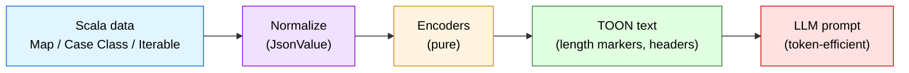
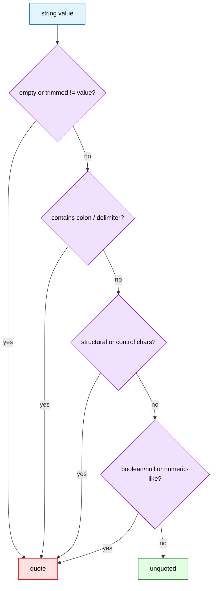
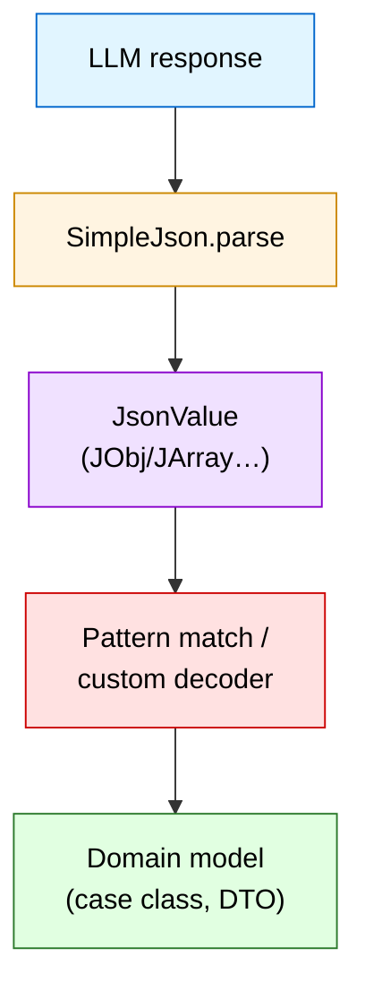

# toon4s: Token-Oriented Object Notation for Scala

[](https://github.com/vim89/toon4s/actions/workflows/ci.yml)
[](https://www.scala-lang.org/)
[](./LICENSE)

`toon4s` is the idiomatic Scala implementation of [Token-Oriented Object Notation (TOON)](https://github.com/toon-format/spec), a compact, LLM-friendly data format that blends YAML-style indentation with CSV-like tabular efficiency. **Save 30-60% on LLM token costs** while maintaining full JSON compatibility.

Built from the ground up with **idiomatic Scala**, `toon4s` delivers:
- **Production-grade reliability**: 381 passing tests, property-based testing, strict validation
- **Zero external dependencies**: Pure Scala stdlib (core is <100KB)
- **Type-safe APIs**: Scala 3 derivation + Scala 2.13 typeclasses
- **High performance**: ~1089 ops/ms tabular decoding, ~213 ops/ms encoding (JMH)
- **LLM-optimized**: Token counting, delimiter optimization, length markers
- **Virtual thread ready**: No ThreadLocal; Java 21+ Project Loom compatible

> **Example**: `{ "tags": ["jazz","chill","lofi"] }` → `tags[3]: jazz,chill,lofi` (40-60% token savings)

## Table of contents

- [Key features & Scala-first USPs](#key-features--scala-first-usps)
- [Benchmarks at a glance](#benchmarks-at-a-glance)
- [Architecture & design patterns](#architecture--design-patterns)
- [Installation](#installation)
- [Quick start (library)](#quick-start-library)
- [CLI usage](#cli-usage)
- [Format crash course](#format-crash-course)
- [Rules & guidelines](#rules--guidelines)
- [API surface](#api-surface)
- [Type safety & conversions](#type-safety--conversions)
- [Using TOON in LLM prompts](#using-toon-in-llm-prompts)
- [Limitations & gotchas](#limitations--gotchas)
- [Syntax cheatsheet](#syntax-cheatsheet)
- [Development & quality gates](#development--quality-gates)
- [License](#license)

---

## Key features & Scala-first benfits

| Theme | What you get | Why it matters on the JVM |
| ----- | ------------ | ------------------------- |
| **Spec‑complete** | Full conformance with TOON v1.4 spec; parity with `toon` (TS) and `JToon` (Java). | Mixed stacks behave the same; token math is consistent across platforms. |
| **Typed APIs (2 & 3)** | Scala 3 derivation for `Encoder`/`Decoder`; Scala 2.13 typeclasses via `ToonTyped`. | Compile‑time guarantees, no `Any`; safer refactors and zero-cost abstractions. |
| **Pure & total** | All encoders/decoders are pure functions; decode returns `Either[DecodeError, JsonValue]`. | Idiomatic FP: easy to compose in Cats/ZIO/FS2; referentially transparent. |
| **Deterministic ADTs** | `JsonValue` as a sealed ADT with `VectorMap` for objects; stable field ordering. | Exhaustive pattern matching; predictable serialization for testing/debugging. |
| **Streaming visitors** | `foreachTabular` and nested `foreachArrays` (tail‑recursive, stack-safe). | Validate/process millions of rows without building a full AST; constant memory usage. |
| **Zero‑dep core** | Core library has zero dependencies beyond Scala stdlib; CLI uses only `scopt` + `jtokkit`. | Tiny footprint (<100KB), simpler audits, no transitive dependency hell. |
| **Strictness profiles** | `Strict` (spec-compliant) vs `Lenient` (error-tolerant) modes with validation policies. | Safer ingestion of LLM outputs and human-edited data; configurable validation. |
| **CLI with budgets** | Built-in `--stats` (token counts), `--optimize` (delimiter selection); cross-platform. | Track token savings in CI/CD; pick optimal delimiter for your data shape. |
| **Virtual thread ready** | No ThreadLocal usage; compatible with Java 21+ Project Loom virtual threads. | Future-proof for modern JVM concurrency; scales to millions of concurrent tasks. |
| **Production hardened** | 381 passing tests; property-based testing; strict mode validation; security limits. | Battle-tested edge cases; prevents DoS via depth/length limits; safe for production. |


See also: [Encoding rules](./SCALA-TOON-SPECIFICATION.md#encoding-rules), [Strict mode](./SCALA-TOON-SPECIFICATION.md#strict-mode-semantics), [Delimiters & markers](./SCALA-TOON-SPECIFICATION.md#delimiters--length-markers)

## Benchmarks at a glance

Be honest: token savings depend on your data. From our runs and community reports:

- Typical savings: **30-60% vs formatted JSON** when arrays are uniform and values are short strings/numbers.
- Small example: `{ "tags": ["jazz","chill","lofi"] }` → `tags[3]: jazz,chill,lofi` saved ~40-60% tokens across common GPT tokenizers.
- Deeply nested, irregular objects: savings narrow; sometimes JSON ties or wins. Measure in CI with `--stats`.
- Retrieval accuracy: some reports show JSON ≈ 70% vs TOON ≈ 65% on certain tasks. If accuracy matters more than cost, validate on your prompts.

Use the CLI or the benchmark runner to measure your payloads:

```
# Option A: CLI (quick)
toon4s-cli --encode payload.json --stats --tokenizer o200k -o payload.toon

# Option B: JMH runner (reproducible set)
sbt jmhDev
```

Throughput (JMH, macOS M‑series, Java 21.0.9, Temurin OpenJDK; 5 warmup iterations × 2s, 5 measurement iterations × 2s):

```
Benchmark              Score      Error   Units
decode_tabular      1089.355 ±  11.111  ops/ms
decode_list          911.614 ±  19.851  ops/ms
decode_nested        734.886 ±  19.845  ops/ms
encode_object        212.611 ±   7.220  ops/ms
```

**Performance Highlights:**
- **Tabular decoding**: ~1089 ops/ms - highly optimized for CSV-like structures
- **List decoding**: ~912 ops/ms - fast array processing
- **Nested decoding**: ~735 ops/ms - efficient for deep object hierarchies
- **Object encoding**: ~213 ops/ms - consistent encoding performance

Note: numbers vary by JVM/OS/data shape. Run your own payloads with JMH for apples‑to‑apples comparison.

### Where we stand vs JToon / toon

- Token savings: format‑driven and therefore similar across implementations. Expect ~30-60% on uniform/tabular data. Example: `{ "tags": ["jazz","chill","lofi"] }` → `tags[3]: jazz,chill,lofi`.
- Accuracy: prompt‑ and data‑dependent. Community reports: JSON ≈ 70%, TOON ≈ 65% on some tasks. Measure on your prompts before switching.
- Throughput: toon4s encode throughput is on par with JToon on small/mid shapes (JMH quick: ~200 ops/ms). Decoding is implemented and fast in toon4s (tabular ~1k ops/ms). If/when JToon adds decoding, compare like‑for‑like.
- Scala ergonomics: typed derivation (3.x), typeclasses (2.13), sealed ADTs, VectorMap ordering, streaming visitors, zero‑dep core.
- Guidance: use toon (TS) for Node stacks, JToon for Java codebases, toon4s for Scala. Token savings are equivalent; choose by ecosystem fit.


Savings are model/tokenizer-sensitive; treat ranges as guidance, not guarantees.

See also: [Token benchmarks](./SCALA-TOON-SPECIFICATION.md#token-benchmarks)

---

## Installation

```scala
// build.sbt
libraryDependencies += "io.toonformat" %% "toon4s-core" % "0.1.0"
```

Prefer CLI only? Ship the staged script (diagram below):

```bash
sbt cli/stage                            # builds ./cli/target/universal/stage/bin/toon4s-cli
./cli/target/universal/stage/bin/toon4s-cli --encode sample.json -o sample.toon
```


---

## Quick start (library)

```scala
import io.toonformat.toon4s._

val payload = Map(
  "users" -> Vector(
    Map("id" -> 1, "name" -> "Ada", "tags" -> Vector("reading", "gaming")),
    Map("id" -> 2, "name" -> "Bob", "tags" -> Vector("writing"))
  )
)

val toon = Toon.encode(payload, EncodeOptions(indent = 2)).fold(throw _, identity)
println(toon)
// users[2]{id,name,tags}:
//   1,Ada,[2]: reading,gaming
//   2,Bob,[1]: writing

val json = Toon.decode(toon).fold(throw _, identity)
println(json)
```

### JVM ergonomics

 - Works with Scala 3.3.3 and Scala 2.13.14 (tested in CI).
 - Accepts Scala collections, Java collections, `java.time.*`, `Option`, `Either`, `Product` (case classes, tuples), and `IterableOnce`.
 - Deterministic ordering when encoding maps via `VectorMap`.
 - Scala 3 derivation: `codec.Encoder` and `codec.Decoder` derive for case classes. Prefer typed `ToonTyped.encode[A: Encoder]` / `ToonTyped.decodeAs[A: Decoder]` over `Any`-based methods.

---

## CLI usage

```bash
# Encode JSON -> TOON with 4-space indentation and tab delimiters
toon4s-cli --encode data.json --indent 4 --delimiter tab -o data.toon

# Decode TOON -> JSON (strict mode on by default)
toon4s-cli --decode data.toon --strict true -o roundtrip.json
```

Available flags:

| Flag | Description |
| ---- | ----------- |
| `--encode` / `--decode` | Required: choose direction explicitly. |
| `--indent <n>` | Pretty-print indentation (default `2`). |
| `--delimiter <comma\|tab\|pipe>` | Column delimiter for tabular arrays. |
| `--length-marker` | Emit `[#N]` markers to disambiguate lengths in prompts. |
| `--stats` | Print input/output token counts and savings to stderr. |
| `--tokenizer <cl100k\|o200k\|p50k\|r50k>` | Select tokenizer for `--stats` (default `cl100k`). |
| `--strict <bool>` | Enforce indentation/escape rules when decoding. |
| `-o, --output <file>` | Target file (stdout when omitted). |

Use `--stats` to measure token impact. Choose a tokenizer with `--tokenizer` (e.g., `o200k`).

---

## Format crash course

TOON borrows two big ideas:

1. **Indentation for structure** (like YAML)
2. **Headers for uniform arrays** (like CSV/TSV)



Example:

```
orders[2]{id,user,total,items}:
  1001,ada,29.70,[3]{sku,qty,price}:
                      A1,2,9.99
                      B2,1,5.50
                      C3,1,4.22
  1002,bob,15.00,[1]: gift-card
```

- `orders[2]` says “array length 2”. Optional `#` makes it `[#2]`.
- `{id,user,...}` declares columns for the following rows.
- Nested arrays either go inline (`[3]: gift-card,store-credit`) or open their own blocks.

Full spec reference: [toon-format/spec](https://github.com/toon-format/spec).

See also: [Encoding rules](./SCALA-TOON-SPECIFICATION.md#encoding-rules)

---

## Rules & guidelines

- **Strict indentation**: use spaces (tabs rejected when `strict=true`). Indent levels must be multiples of `DecodeOptions.indent`.
- **Quotes only when required**: strings with spaces, delimiters, or structural characters need `".."` wrapping.
- **Length markers**: recommended for LLM prompts; they let you validate response lengths quickly.
- **Delimiters**: choose comma (default), tab (token-efficient), or pipe (human-friendly). The delimiter is encoded in the header, so consumers know what to expect.
- **Uniform rows**: tabular arrays must have consistent field counts; strict mode enforces this.

Quoting vs. unquoted strings (encoder rules):

| Condition | Needs quotes? | Reason |
| --------- | -------------- | ------ |
| Empty string | Yes | Ambiguous if unquoted. |
| Leading/trailing whitespace | Yes | Preserves spaces. |
| Contains `:` | Yes | Conflicts with key separators. |
| Contains delimiter (`,`/`\t`/`|`) | Yes | Conflicts with row splitting. |
| Contains `"` or `\\` | Yes | Must be escaped inside quotes. |
| Contains `[ ] { }` | Yes | Structural tokens. |
| Contains `\n`, `\r`, `\t` | Yes | Control characters. |
| Starts with `-` at list depth | Yes | Could be parsed as list marker. |
| Boolean/Null literal: `true`/`false`/`null` | Yes | Avoids primitive coercion. |
| Looks numeric (e.g., `-12`, `1.2e5`, `01`) | Yes | Avoids numeric coercion; leading zeros are reserved. |



See also: [Encoding rules](./SCALA-TOON-SPECIFICATION.md#encoding-rules)

---

## API surface

| Package | Purpose |
| ------- | ------- |
| `io.toonformat.toon4s` | Core types: `Toon`, `JsonValue`, `EncodeOptions`, `DecodeOptions`, `Delimiter`. Typed entry points live in `ToonTyped`: `ToonTyped.encode[A: Encoder]`, `ToonTyped.decodeAs[A: Decoder]`. |
| `io.toonformat.toon4s.encode.*` | `Encoders`, primitive formatting helpers. |
| `io.toonformat.toon4s.decode.*` | `Decoders`, parser/validation utilities. |
| `io.toonformat.toon4s.decode.Streaming` | Streaming visitors for tabular arrays (`foreachTabular`) and nested arrays (`foreachArrays`). |
| `io.toonformat.toon4s.json.SimpleJson` | Lightweight JSON AST + parser/stringifier used in tests/CLI. |
| `io.toonformat.toon4s.cli.*` | CLI wiring (`Main`, token estimator). |

Most teams only interact with `Toon.encode`, `Toon.decode`, and `JsonValue` pattern matching. Lower-level modules stay internal unless you are extending the format.

See also: [JsonValue ADT](./SCALA-TOON-SPECIFICATION.md#representation-jsonvalue-adt), [Encoding model](./SCALA-TOON-SPECIFICATION.md#encoding-model), [Decoding rules](./SCALA-TOON-SPECIFICATION.md#decoding-rules)

---

## Type safety & conversions

| Scala type | TOON behaviour |
| ---------- | -------------- |
| `String`, `Boolean`, `Byte/Short/Int/Long`, `Float/Double`, `BigDecimal` | Direct primitives; floats/ doubles silently drop `NaN/Inf` → `null` (to stay deterministic). |
| `Option[A]` | `Some(a)` → encode `a`; `None` → `null`. |
| `Either[L, R]` | Encoded as JSON-like objects (`{"Left": ...}`) via product encoding. Consider normalizing upstream. |
| `Iterable`, `Iterator`, `Array` | Encoded as TOON arrays, falling back to list syntax when not tabular. |
| `Map[String, _]`, `VectorMap` | Preserve insertion order; keys auto-quoted when needed. |
| `Product` (case classes / tuples) | Converted through `productElementNames` + `productIterator`. |
| `Java time` (`Instant`, `ZonedDateTime`, etc.) | ISO‑8601 strings, UTC-normalized for deterministic prompts. |

Preferred (Scala 3): typed APIs with type classes.

```scala
import io.toonformat.toon4s._
import io.toonformat.toon4s.codec.{Encoder, Decoder}

case class User(id: Int, name: String) derives Encoder, Decoder

val s: String = Toon.encode(User(1, "Ada")).fold(throw _, identity)
val u: User   = ToonTyped.decodeAs[User](s).fold(throw _, identity)
```

Fallbacks:
- Decoding always yields the `JsonValue` ADT; pattern-match it if you prefer.
- `SimpleJson.toScala` yields `Any` for quick-and-dirty interop.

Why another TOON for Scala?

- Ergonomics: native Scala APIs and derivation reduce boilerplate versus Java/TS bindings in Scala codebases.
- Footprint: zero-dep core minimizes transitive risk compared to libraries built atop general JSON stacks.
- Streaming: visitors let you validate/model-check row counts without paying for full tree allocation.
- Parity: same token savings as JToon/toon because the format drives savings, not the implementation.
- Throughput: competitive decode throughput (see JMH); encode throughput is solid and easy to reason about.

See also: [Encoding model](./SCALA-TOON-SPECIFICATION.md#encoding-model), [JsonValue ADT](./SCALA-TOON-SPECIFICATION.md#representation-jsonvalue-adt)



---

## Using TOON in LLM prompts

**Prompt scaffolding idea:**

```
System: You are a precise data validator.
User:
Please read the following TOON payload describing purchase orders.
Return JSON with fields {id, total, status} for every order with total > 100.
Validate row counts against the markers.
```

Then attach:

```
orders[#3]{id,total,status}:
  101,250.10,pending
  102,89.00,fulfilled
  103,140.00,review
```

Why it helps:

- Length markers give you a checksum (“model must return 3 rows”).
- Tabular headers reduce hallucinations (model sees explicit columns).
- Reduced tokens = cheaper prompts; faster iteration = cheaper eval runs.

For response validation, decode the model output using `Toon.decode` (if the LLM responds in TOON) or rehydrate JSON responses and compare lengths/keys.

See also: [Delimiters & markers](./SCALA-TOON-SPECIFICATION.md#delimiters--length-markers), [Strict mode](./SCALA-TOON-SPECIFICATION.md#strict-mode-semantics)

---

## Limitations & gotchas

- **Irregular arrays**: when rows differ in shape, TOON falls back to YAML-like list syntax; token savings shrink.
- **Binary blobs**: not supported; encode as Base64 strings manually.
- **Streaming decode limitation**: `Toon.decode()` and `Toon.decodeFrom()` read the entire input into memory before parsing. For very large files (>100MB), consider memory constraints. While `Streaming.foreachTabular` and `Streaming.foreachArrays` provide streaming validation of tabular sections, full streaming decode support (incremental parsing of entire documents) is deferred to version 0.2.0. Current workarounds for large files:
  - Split input into multiple smaller TOON documents upstream
  - Use the streaming visitors (`Streaming.foreachTabular`, `Streaming.foreachArrays`) for row-by-row validation without full AST allocation
  - Increase JVM heap size (`-Xmx`) when processing large trusted inputs
- **Locale-specific numbers**: encoder always uses `.` decimal separators; ensure inputs are normalized beforehand.
- **CLI tokenizer**: `TokenEstimator` currently defaults to `CL100K_BASE` (GPT‑4/3.5). Model-specific differences apply.

---

## Syntax cheatsheet

| Construct | Example | Notes |
| --------- | ------- | ----- |
| Object | `user:\n  id: 123\n  name: Ada` | Indentation defines nesting. |
| Inline primitives | `tags[3]: reading,gaming,coding` | Quotes only when needed. |
| Tabular array | `users[2]{id,name}:\n  1,Ada\n  2,Bob` | Header defines columns. |
| Nested tabular | `orders[1]{id,items}:\n  1,[2]{sku,qty}: ...` | Inner header scoped to nested block. |
| Length marker | `items[#2|]{sku|qty}` | `#` emphasizes count; `|` encodes delimiter. |
| Empty array/object | `prefs[0]:` or `prefs: {}` | Choose whichever fits your schema. |
| Comments | *(not part of spec - strip before encoding)* | Keep prompts clean; TOON itself has no comment syntax. |

---

## Development & quality gates

```bash
sbt scalafmtCheckAll   # formatting
sbt +test              # Scala 2.13 and 3.3 suites
./smoke-tests/run-smoke.sh
```

GitHub Actions runs:

1. **Quick checks**: scalafmt + `+compile` on Ubuntu.
2. **Matrix tests**: Linux/macOS/Windows × Scala 2.13 & 3.3, with test-report artifacts when a shard fails.
3. **Smoke**: CLI round trip script on Ubuntu.
4. **All checks pass** “gate” job.

### Performance (JMH)

- Quick run (single iteration, small windows):

```
sbt "jmh/jmh:run -i 1 -wi 1 -r 500ms -w 500ms -f1 -t1 io.toonformat.toon4s.jmh.EncodeDecodeBench.*"
```

- Typical run:

```
sbt "jmh/jmh:run -i 5 -wi 5 -f1 -t1 io.toonformat.toon4s.jmh.EncodeDecodeBench.*"
```

Or use aliases:

```
sbt jmhDev   # quick check
sbt jmhFull  # heavy run
```

#### Benchmarks Methodology

- Intent: publish indicative throughput numbers for common shapes (tabular, lists, nested objects) under reproducible settings.
- Harness: JMH via `sbt-jmh` 0.4.5. Single thread (`-t1`), single fork (`-f1`).
- Quick config: `-i 1 -wi 1 -r 500ms -w 500ms` (fast sanity; noisy but useful for local checks).
- Heavy config: `-i 5 -wi 5 -r 2s -w 2s` (more stable). CI runs this set with a soft 150s guard.
- Reporting: CI also emits JSON (`-rf json -rff /tmp/jmh.json`) and posts a summary table on PRs.
- Machine baseline (indicative): macOS Apple M‑series (M2/M3), Temurin Java 21, default power settings.
- Guidance: close heavy apps/IDEs, plug in AC power, warm JVM before measurement. Numbers vary by OS/JVM/data shapes—treat them as relative, not absolute.

### Streaming visitors

- Tabular rows only:

```scala
import io.toonformat.toon4s.decode.Streaming
val reader = new java.io.StringReader("""
users[2]{id,name}:
  1,Ada
  2,Bob
""".stripMargin)
Streaming.foreachTabular(reader) { (key, fields, values) =>
  // key = Some("users"), fields = List("id","name"), values = Vector("1","Ada") then Vector("2","Bob")
}
```

- Nested arrays with path:

```scala
val reader2 = new java.io.StringReader("""
orders[1]{id,items}:
  1001,[2]{sku,qty}:
    A1,2
    B2,1
""".stripMargin)
Streaming.foreachArrays(reader2)({ (path, header) =>
  // path: Vector("orders") when header key is bound
})( { (path, header, values) =>
  // values: Vector("A1","2"), then Vector("B2","1")
})
```

When to use streaming

- Validate/model‑check tabular sections quickly (row counts, required columns) without allocating a full AST.
- Pipe rows directly to sinks (CSV writers, database ingesters, online aggregation) for large payloads.
- Pre‑filter/transform rows on the fly before passing trimmed data to LLMs.
- Keep full `Toon.decode` for non‑tabular or when you need the entire tree (e.g., complex nested edits).

---

## License

MIT - see [LICENSE](./LICENSE).
