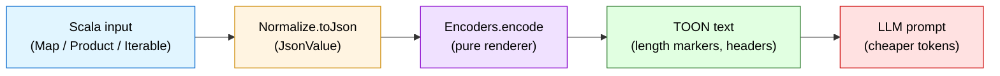
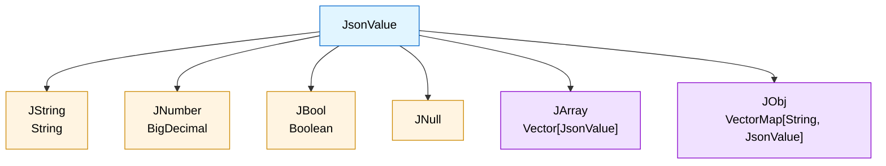
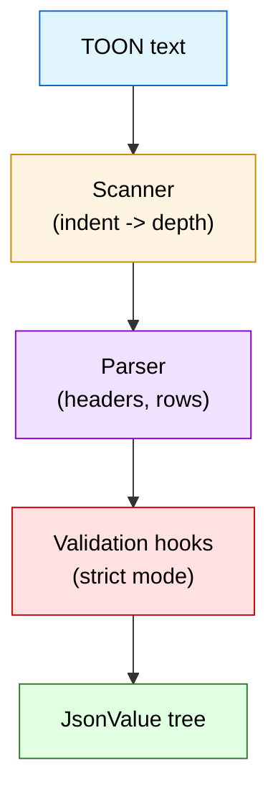
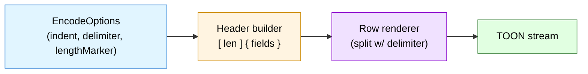
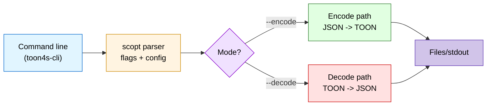
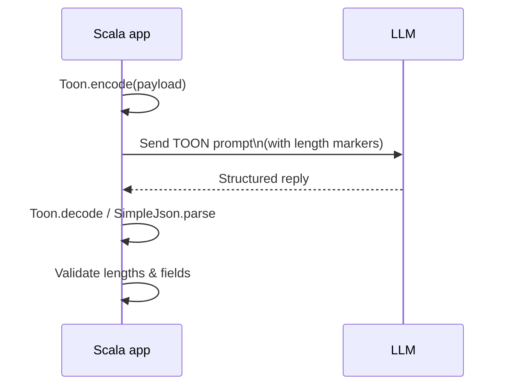

# toon4s - Scala Implementation Specification

**Token-Oriented Object Notation (TOON)** is a compact, LLM-friendly serialization format that trades JSON's repeated keys and punctuation for indentation, column headers, and explicit row counts. This document describes the Scala (for JVM as well) implementation (`toon4s`), its guarantees, and how the format behaves on the JVM.

> If you want the canonical language-agnostic definition, read [toon-format/spec](https://github.com/toon-format/spec). This spec focuses on the Scala API, data model, and rules enforced by `toon4s`.

## Why TOON for JVM teams?

- **Token savings** mean cheaper LLM calls. TOON payloads routinely cut 30-60% of tokens versus pretty JSON.
- **Scala-first APIs** let you pass case classes, immutable maps, Options, and `java.time` values directly-no JSON intermediary required.
- **Deterministic behavior** (sealed ADTs, pure functions, explicit errors) makes TOON fit functional stacks (Cats, ZIO) and strict JVM services.
- **Guardrails** (length markers, tabular headers, strict indentation) improve LLM reliability when you force models to echo structured responses.

## Contents

1. [Format comparison](#format-comparison)
2. [Token benchmarks](#token-benchmarks)
3. [Encoding model](#encoding-model)
4. [Representation (`JsonValue` ADT)](#representation-jsonvalue-adt)
5. [Encoding rules](#encoding-rules)
6. [Decoding rules](#decoding-rules)
7. [Strict mode semantics](#strict-mode-semantics)
8. [Delimiters & length markers](#delimiters--length-markers)
9. [CLI behavior](#cli-behavior)
10. [LLM prompt usage](#llm-prompt-usage)
11. [Limitations & edge cases](#limitations--edge-cases)
12. [Conformance & testing](#conformance--testing)

---

## Format comparison

| Format | Strengths | Weaknesses vs TOON |
| ------ | --------- | ------------------ |
| JSON | ubiquitous, tooling everywhere | verbose (repeated keys, braces), harder to inspect in prompts |
| YAML | concise structure, comments | indentation-sensitive but still repeats keys for arrays |
| CSV/TSV | minimal tokens for flat tables | no nested structure, cannot represent objects |
| **TOON** | indentation for nesting, tabular headers for uniform arrays, length markers for guardrails | best when arrays share schema; falls back to list syntax for irregular rows |

When an array is uniform (same keys per row) TOON uses CSV-style rows and avoids repeating keys. For ragged arrays it falls back to YAML-like list entries, so JSON can be cheaper; use `Toon.encode` and inspect the output when in doubt.

---

## Token benchmarks

Measured with the GPT `o200k_base` tokenizer using `jtokkit`:

```
GitHub Repositories (uniform objects)     ██████████████░░░░░░░░░░░    8,745 (TOON)
                                          vs JSON: 15,145  (-42%)
                                          vs XML : 17,095  (-49%)

Daily Analytics Feed (rows with numbers)  ██████████░░░░░░░░░░░░░░░    4,507 (TOON)
                                          vs JSON:  9,234  (-51%)
```

Savings vary with schema complexity, but any payload where you repeat columns across hundreds of entries benefits immediately.

---

## Encoding model

Preferred (Scala 3): `ToonTyped.encode[A: Encoder](value, options)` and `ToonTyped.decodeAs[A: Decoder](string, options)` provide typed entry points. Under the hood, the encoding path performs two steps:

1. **Normalization** - Convert arbitrary Scala values to the `JsonValue` ADT (`Normalize.toJson`).
2. **Rendering** - Convert the `JsonValue` tree to TOON text using `Encoders.encode`.



Normalization rules (selected):

| Scala input | JsonValue output |
| ----------- | ---------------- |
| `String` | `JString` |
| `Boolean` | `JBool` |
| Numeric primitives, `BigDecimal`, `BigInt` | `JNumber` (exact precision) |
| `Option[A]` | `JNull` for `None`, otherwise convert the value |
| `Map[String, _]`, `VectorMap` | `JObj` preserving iteration order |
| `Iterable[_]`, `Array[_]` | `JArray` |
| `Product` (case classes, tuples) | `JObj` using `productElementNames` |
| `java.time.*` (`Instant`, `LocalDate`, …) | ISO-8601 strings |
| `TemporalAccessor` without instant info | `JString(DateTimeFormatter.ISO_DATE_TIME.format)` fallback |

> Non-finite doubles/floats (`NaN`, `±Inf`) normalize to `JNull` to keep deterministic output.

---

## Representation (`JsonValue` ADT)

```scala
sealed trait JsonValue
object JsonValue {
  final case class JString(value: String)                    extends JsonValue
  final case class JNumber(value: BigDecimal)                extends JsonValue
  final case class JBool(value: Boolean)                     extends JsonValue
  case object JNull                                          extends JsonValue
  final case class JArray(value: Vector[JsonValue])          extends JsonValue
  final case class JObj(value: VectorMap[String, JsonValue]) extends JsonValue
}
```

This ADT underpins both encoding and decoding. Pattern match on it to extract fields, or call `SimpleJson.stringify` to hop back to JSON. For domain types, prefer the Scala 3 type classes:

```scala
import io.toonformat.toon4s._
import io.toonformat.toon4s.codec.{Encoder, Decoder}

case class Data(users: List[String]) derives Encoder, Decoder

val s   = Toon.encode(Data(List("Ada")))
val d   = ToonTyped.decodeAs[Data](s.fold(throw _, identity))
```



---

## Encoding rules

1. **Objects** become indentation-based blocks:
   ```
   user:
     id: 123
     name: Ada
   ```
2. **Primitive arrays** default to inline syntax:
   `tags[3]: reading,gaming,coding`
3. **Tabular arrays** surface when an array of objects shares identical keys. A header and row count precede the rows:
   ```
   users[2]{id,name,role}:
     1,Ada,admin
     2,Bob,user
   ```
4. **Nested tabular arrays** declare their own headers inside the parent row:
   ```
   orders[1]{id,items}:
     1001,[2]{sku,qty}:
       A1,2
       B2,1
   ```
5. **Length markers (`#`)** are optional but recommended for LLM prompts: `items[#2|]{sku|qty}`.
6. **Delimiters** default to comma. Tab (`\t`) or pipe (`|`) can be selected via `EncodeOptions`. The delimiter character appears after the length / inside the braces to keep readers honest (`[2\t]{a\tb}` or `[2|]{a|b}`).
7. **Quoting rules** mirror JSON: quote strings when they contain whitespace, delimiters, `:`, `"`, `,`, `[`, `]`, `{`, `}`, or start with `- `.
8. **Empty structures**: `prefs[0]:` (empty array) or `prefs: {}` (empty object).

Inline vs block selection:

- Primitive arrays -> inline unless huge (controlled upstream).
- Object arrays -> tabular when keys align, else fallback list syntax:
  ```
  tasks:
    - id: 1
      name: sync
    - id: 2
      tags[1]: urgent
  ```

---

## Decoding rules

`Toon.decode(string, DecodeOptions)` parses the input to `JsonValue` or returns `DecodeError`:

- `Syntax` - malformed indentation, unterminated strings, unknown escape sequences, missing colon, etc.
- `Range` - row count mismatch, extra tabular rows, list item overflows.
- `InvalidHeader` - bracket/brace segments misdeclared.
- `Unexpected` - catch-all for parser bugs.

Decoder algorithm highlights:

1. **Indentation scanner** tokenizes lines into `ParsedLine` (depth implied by spaces). Tabs are forbidden in strict mode.
2. **Array header detection** checks for `[length]{fields}` patterns, capturing delimiters and markers.
3. **Delimited rows** split on the negotiated delimiter, respecting quotes and escapes.
4. **Primitive detection** chooses between strings, booleans, null, or numbers based on literal regexes.
5. **Validation hooks** ensure row/field counts match the header when `strict = true`.



---

## Strict mode semantics

`DecodeOptions(strict = true)` (default) enforces:

- Indentation must be multiples of `indent` (default `2` spaces).
- No tab characters before content.
- Tabular rows must match header field count.
- Tabular arrays cannot contain blank lines between rows.
- List arrays cannot have extra `-` entries beyond declared length.
- Inline array lengths must match actual element count.

Relaxing `strict` tolerates indentation quirks and length mismatches but still rejects syntax errors (unterminated strings, invalid escapes, etc.).

---

## Delimiters & length markers

- `EncodeOptions.delimiter`: `Delimiter.Comma` | `Delimiter.Tab` | `Delimiter.Pipe`.
- `EncodeOptions.lengthMarker`: when `true`, headers use `[#N]` instead of `[N]`. Combined with alternate delimiters: `items[#2|]{sku|qty}` or `tags[#3\t]: a\tb\tc`.

Choosing delimiters:

| Delimiter | When to use |
| --------- | ----------- |
| Comma | Default, human-friendly, works for most data. |
| Tab | Token-efficient for numeric-heavy tables, rarely needs quoting. |
| Pipe | Easier to eyeball when values already contain commas or tabs. |

Length markers should be enabled for LLM prompts or whenever you want the decoder/model to prove row counts.



---

## CLI behavior

`toon4s-cli` provides:

- `--encode <file>` / `--decode <file>` (direction)
- `--indent <n>`
- `--delimiter comma|tab|pipe`
- `--length-marker`
- `--strict true|false`
- `--output <file>` (stdout fallback)
- `--stats` (print token counts and savings)
- `--tokenizer cl100k|o200k|p50k|r50k` (for `--stats`, default `cl100k`)

It uses the same `SimpleJson` helper for JSON round-trips, ensuring CLI ↔ library parity. `TokenEstimator` (jtokkit, CL100K base) will surface in future releases to log token counts after each conversion.



---

## LLM prompt usage

Basic prompt template:

```
System: You are a strict validator. Respect row counts.
User:
orders[#3]{id,total,status}:
  101,250.10,pending
  102,89.00,fulfilled
  103,140.00,review
```

Guidelines:

1. Always send row counts/headers so the model knows expected output cardinality.
2. Ask the model to respond in TOON or JSON, then parse with `Toon.decode` or `SimpleJson.parse`.
3. Validate model output by comparing array lengths and field names.
4. Prefer tab delimiters for numeric-heavy tables; they tokenize cheaper.



---

## Limitations & edge cases

- **Irregular arrays** degrade to list syntax (less compact).
- **Binary / large blobs** should be base64 before encoding.
- **Streaming** not implemented; `Toon.decode` expects whole strings in memory.
- **Java interop**: `toon4s` exposes only Scala collections. For Java call sites, wrap `Toon.encode`/`decode` with conversion helpers.
- **Non-scalar map keys** get `toString`'d; prefer `Map[String, _]` or `VectorMap`. 

---

## Conformance & testing

- `core/src/test/.../ConformanceSuite.scala` loads fixtures from `spec/tests/fixtures` and asserts parity with the reference TS implementation.
- `DecodeSpec` covers parser edge cases (blank lines, strict mode errors).
- Smoke tests stage the CLI, run JSON→TOON→JSON round trips, and compare payloads.
- CI matrix executes `sbt -Dsbt.log.noformat=true ++<scalaVersion> test` on Linux, macOS, Windows.

You can run the full suite locally:

```bash
sbt scalafmtCheckAll
sbt +test
./smoke-tests/run-smoke.sh
```

### Performance benchmarking (JMH)

We include JMH microbenchmarks covering encode/decode on representative shapes (tabular rows, list arrays, nested objects), plus large and irregular cases.

Examples (quick):

```
sbt "jmh/jmh:run -i 1 -wi 1 -r 500ms -w 500ms -f1 -t1 io.toonformat.toon4s.jmh.EncodeDecodeBench.*"
```

Indicative throughput (macOS M-series, Java 21, single fork, 1×500ms warmup/measure):

```
decode_tabular    ~ 1051 ops/ms
decode_list       ~  920 ops/ms
encode_object     ~  200 ops/ms
```

Use larger windows (e.g., `-i 5 -wi 5`) on a stable machine for trustworthy numbers.

---

## See also

- [Main README](./README.md) - installation, usage, CLI examples.
- [toon-format/spec](https://github.com/toon-format/spec) - canonical format specification & fixtures.
- [JToon](https://github.com/felipestanzani/jtoon) - JVM reference in Kotlin/Java.
- [TypeScript implementation](https://github.com/toon-format/toon).
