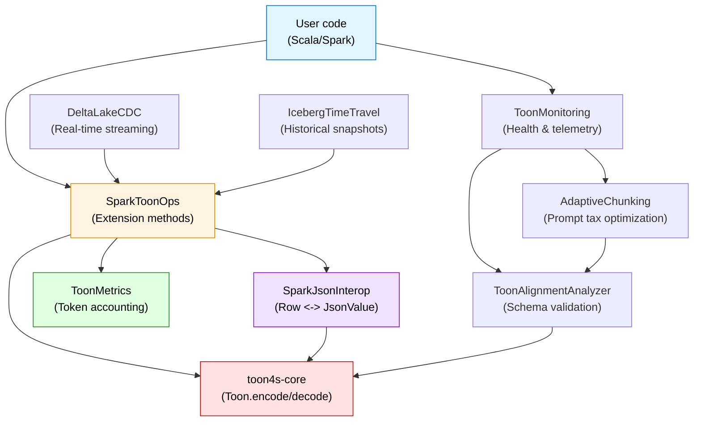
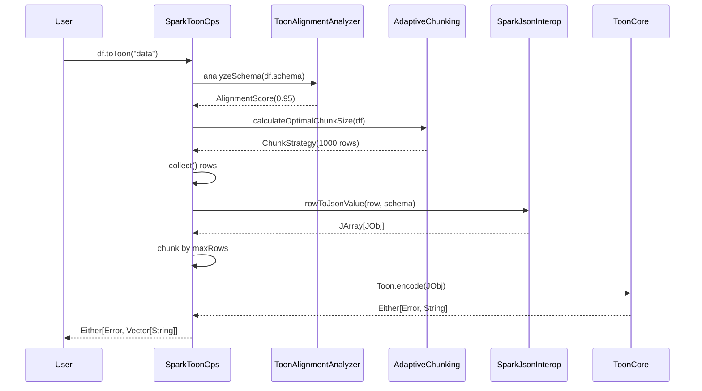

# toon4s-spark

[Apache Spark](https://spark.apache.org/) integration for TOON format - encode DataFrames, Datasets to token-efficient
TOON format for LLM processing.

## Overview

toon4s-spark provides production-ready TOON encoding for Apache Spark DataFrames and Datasets. Based on
the [TOON Generation Benchmark](https://github.com/vetertann/TOON-generation-benchmark), this integration delivers **22%
token savings** for tabular data with intelligent safeguards for schema alignment and prompt tax optimization.

### When to use TOON vs JSON

**TOON wins:**

- Tabular data (flat or shallow nesting)
- Large datasets (> 10KB)
- Repeated LLM processing
- Token cost is a concern

**Use JSON instead:**

- Deep hierarchies (3+ nesting levels)
- Small datasets (< 1KB)
- One-time queries
- Schema evolution uncertainty

### Benchmark results

TOON generation benchmark:

| Dataset type         | Nesting depth | TOON accuracy   | Token savings | Recommendation |
|----------------------|---------------|-----------------|---------------|----------------|
| **users** (tabular)  | 0-1 levels    | **90.5%**       | **22%**       | **TOON wins**  |
| **order** (shallow)  | 2 levels      | 78.6%           | ~18%          | TOON good      |
| **invoice** (medium) | 3 levels      | 52.4%           | ~12%          | TOON marginal  |
| **company** (deep)   | 4+ levels     | **0%** one-shot | N/A           | **Use JSON**   |

> **Key finding**: TOON excels at **tabular lakehouse data** (the primary Spark use case) but fails on deep hierarchies.

## Features

- **DataFrame <-> TOON conversion**: Pure functional API with Either error handling
- **Type-safe Dataset[T] support**: Compile-time safety with Scala case classes
- **Schema alignment detection**: Pre-flight validation based on benchmark findings
- **Adaptive chunking**: Optimize prompt tax for dataset size
- **Token metrics**: Compare JSON vs TOON token counts and cost savings
- **Delta Lake CDC integration**: Real-time TOON streaming from Change Data Feed
- **Iceberg time travel**: Historical TOON snapshots for trend analysis
- **Production monitoring**: Health checks, telemetry, and readiness reports
- **SQL UDFs**: Register TOON functions for use in Spark SQL queries
- **LLM client abstraction**: [llm4s](https://github.com/llm4s/llm4s)-compatible conversation-based API
- **Forward compatible**: Designed to integrate seamlessly with llm4s when available

## Installation

Add to your `build.sbt`:

```scala
libraryDependencies += "com.vitthalmirji" %% "toon4s-spark" % "0.1.0"
```

For spark applications, use `provided` scope since Spark is typically provided by the cluster:

```scala
libraryDependencies ++= Seq(
  "com.vitthalmirji" %% "toon4s-spark" % "0.1.0",
  "org.apache.spark" %% "spark-sql" % "3.5.0" % Provided
)
```

## Quick start

### DataFrame to TOON

```scala
import io.toonformat.toon4s.spark.SparkToonOps._
import org.apache.spark.sql.SparkSession

val spark = SparkSession.builder()
  .appName("TOON Example")
  .getOrCreate()

import spark.implicits._

val df = Seq(
  (1, "Alice", 25),
  (2, "Bob", 30)
).toDF("id", "name", "age")

// Encode DataFrame to TOON
df.toToon(key = "users") match {
  case Right(toonChunks) =>
    toonChunks.foreach { toon =>
      println(s"TOON: $toon")
      // Send to LLM or save to storage
    }
  case Left(error) =>
    println(s"Error: ${error.message}")
}
```

### Token metrics

```scala
// Compare JSON vs TOON token efficiency
df.toonMetrics(key = "data") match {
  case Right(metrics) =>
    println(metrics.summary)
    // Output:
    // Token Metrics:
    //   JSON tokens: 150
    //   TOON tokens: 90
    //   Savings: 60 tokens (40.0%)
    //   Rows: 2, Columns: 3

    val costSavings = metrics.estimatedCostSavings(costPer1kTokens = 0.002)
    println(f"Est. cost savings: $$${costSavings}%.4f")

  case Left(error) =>
    println(s"Error: ${error.message}")
}
```

### SQL UDFs

```scala
import io.toonformat.toon4s.spark.ToonUDFs

// Register TOON functions for SQL
ToonUDFs.register(spark)

spark.sql(
  """
  SELECT
    id,
    name,
    toon_encode_row(struct(id, name, age)) as toon_data,
    toon_estimate_tokens(struct(id, name, age)) as token_count
  FROM users
""").show()
```

### Round-trip conversion

```scala
implicit val sparkSession: SparkSession = spark

val originalDf = df.select("id", "name", "age")
val schema = originalDf.schema

val result = for {
  toonChunks <- originalDf.toToon(key = "data")
  decodedDf <- SparkToonOps.fromToon(toonChunks, schema)
} yield decodedDf

result match {
  case Right(reconstructed) =>
    reconstructed.show()
  case Left(error) =>
    println(s"Error: ${error.message}")
}
```

### Chunking large DataFrames

```scala
// Handle large datasets with automatic chunking
val largeDf = spark.read.parquet("large_dataset.parquet")

largeDf.toToon(
  key = "data",
  maxRowsPerChunk = 1000 // Process 1000 rows per chunk
) match {
  case Right(chunks) =>
    println(s"Created ${chunks.size} chunks")
    chunks.zipWithIndex.foreach { case (toon, idx) =>
      // Process each chunk independently
      saveToon(s"chunk_$idx.toon", toon)
    }
  case Left(error) =>
    println(s"Error: ${error.message}")
}
```

### LLM integration [llm4s-compatible](https://github.com/llm4s/llm4s)

`toon4s-spark` provides an LLM client abstraction that mirrors [llm4s](https://github.com/llm4s/llm4s) design patterns for
forward compatibility.

#### Conversation-based API

```scala
import io.toonformat.toon4s.spark.llm._

// Create conversation
val conversation = for {
  sys <- Message.system("You are a data analyst")
  user <- Message.user("Analyze this data: ...")
  conv <- Conversation.create(sys, user)
} yield conv

// Use mock client for testing
val client = MockLlmClient.alwaysSucceeds

conversation.flatMap { conv =>
  client.complete(conv, CompletionOptions.default)
} match {
  case Right(completion) =>
    println(s"Response: ${completion.content}")
    println(s"Tokens: ${completion.usage}")
  case Left(error) =>
    println(s"Error: ${error.formatted}")
}
```

#### Send TOON data to LLM

```scala
df.toToon(key = "analytics_data") match {
  case Right(toonChunks) =>
    toonChunks.foreach { toon =>
      val result = for {
        conv <- Conversation.fromPrompts(
          "You are a data analyst",
          s"Analyze this data:\n$toon"
        )
        completion <- client.complete(conv)
      } yield completion

      result.foreach { completion =>
        println(s"Analysis: ${completion.content}")
        completion.usage.foreach { usage =>
          println(s"Cost: ${usage.estimateCost(0.01, 0.03)}")
        }
      }
    }
  case Left(error) =>
    println(s"Encoding error: ${error.message}")
}
```

#### Backward-compatible string API

```scala
// Simple string-based API for quick prototyping
val client = MockLlmClient(Map("test" -> "response"))

client.completeSimple("What is 2+2?") match {
  case Right(response) => println(response)
  case Left(error) => println(error.message)
}

// With system prompt
client.completeWithSystem(
  "You are helpful",
  "What is 2+2?"
) match {
  case Right(response) => println(response)
  case Left(error) => println(error.message)
}
```

#### Streaming support

```scala
val result = for {
  conv <- Conversation.userOnly("Tell me a story")
  completion <- client.streamComplete(conv) { chunk =>
    chunk.content.foreach(print) // Print each chunk as it arrives
  }
} yield completion
```

#### Context window management (llm4s pattern)

```scala
val client = MockLlmClient.alwaysSucceeds

// Check context limits
val contextWindow = client.getContextWindow() // 128000 for GPT-4o
val reserved = client.getReserveCompletion() // 4096 reserved for output

// Calculate available budget
val budget = client.getContextBudget(HeadroomPercent.Standard)
println(s"Available: ${budget.available} tokens")

// Check if prompt fits
if (budget.fits(promptTokens)) {
  // Send to LLM
}
```

## API reference

### Extension methods on DataFrame

**`toToon(key: String, maxRowsPerChunk: Int, options: EncodeOptions): Either[SparkToonError, Vector[String]]`**

Encode DataFrame to TOON format with chunking support.

- `key`: Top-level key for TOON document (default: "data")
- `maxRowsPerChunk`: Maximum rows per chunk (default: 1000)
- `options`: TOON encoding options (default: EncodeOptions())

**`toonMetrics(key: String, options: EncodeOptions): Either[SparkToonError, ToonMetrics]`**

Compute token metrics comparing JSON vs TOON efficiency.

**`showToonSample(n: Int): Unit`**

Print a sample of TOON-encoded data for debugging (default: 5 rows).

### Static methods

**
`SparkToonOps.fromToon(toonDocuments: Vector[String], schema: StructType, options: DecodeOptions)(implicit spark: SparkSession): Either[SparkToonError, DataFrame]`
**

Decode TOON strings back to DataFrame.

### SQL UDFs

Register with `ToonUDFs.register(spark)`:

- `toon_encode_row(struct)`: Encode struct to TOON
- `toon_decode_row(string)`: Decode TOON to struct
- `toon_encode_string(string)`: Encode string value
- `toon_decode_string(string)`: Decode TOON string
- `toon_estimate_tokens(string)`: Estimate token count

### ToonMetrics

```scala
case class ToonMetrics(
                        jsonTokenCount: Int,
                        toonTokenCount: Int,
                        savingsPercent: Double,
                        rowCount: Int,
                        columnCount: Int
                      )
```

Methods:

- `absoluteSavings: Int` - Token count difference
- `compressionRatio: Double` - TOON/JSON ratio
- `estimatedCostSavings(costPer1kTokens: Double): Double` - Cost savings estimate
- `hasMeaningfulSavings(threshold: Double): Boolean` - Check if savings exceed threshold
- `summary: String` - Formatted summary

### Error handling

All operations return `Either[SparkToonError, A]` for explicit error handling:

```scala
sealed trait SparkToonError {
  def message: String

  def cause: Option[Throwable]
}

object SparkToonError {
  case class ConversionError(message: String, cause: Option[Throwable] = None)

  case class EncodingError(toonError: EncodeError, cause: Option[Throwable] = None)

  case class DecodingError(toonError: DecodeError, cause: Option[Throwable] = None)

  case class SchemaMismatch(expected: String, actual: String, cause: Option[Throwable] = None)

  case class CollectionError(message: String, cause: Option[Throwable] = None)

  case class UnsupportedDataType(dataType: String, cause: Option[Throwable] = None)
}
```

## Configuration

### Java 17+ compatibility

For Java 17 or later, add these JVM options:

```scala
// build.sbt
Test / javaOptions ++= Seq(
  "--add-opens=java.base/sun.nio.ch=ALL-UNNAMED",
  "--add-opens=java.base/sun.nio.cs=ALL-UNNAMED"
)
```

### Spark configuration

```scala
val spark = SparkSession.builder()
  .appName("TOON App")
  .config("spark.sql.shuffle.partitions", "100")
  .config("spark.executor.memory", "4g")
  .getOrCreate()
```

## Advanced features

### Schema alignment detection

Validate DataFrame schema is TOON-aligned before encoding:

```scala
import io.toonformat.toon4s.spark.ToonAlignmentAnalyzer._

val df = spark.read.table("production.events")
val alignment = analyzeSchema(df.schema)

println(s"Alignment score: ${alignment.score}")
println(s"TOON aligned: ${alignment.aligned}")
println(s"Expected accuracy: ${alignment.expectedAccuracy}")
println(s"Recommendation: ${alignment.recommendation}")

if (!alignment.aligned) {
  alignment.warnings.foreach(println)
  // Consider using JSON instead
}
```

### Adaptive chunking

Optimize prompt tax by calculating optimal chunk size:

```scala
import io.toonformat.toon4s.spark.AdaptiveChunking._

val df = spark.read.table("analytics.metrics")
val strategy = calculateOptimalChunkSize(df)

println(s"Recommended chunk size: ${strategy.chunkSize} rows")
println(s"Use TOON: ${strategy.useToon}")
println(s"Reasoning: ${strategy.reasoning}")

if (strategy.useToon) {
  df.toToon(maxRowsPerChunk = strategy.chunkSize) match {
    case Right(chunks) => // Process chunks
    case Left(error) => // Handle error
  }
} else {
  // Fall back to JSON
  df.toJSON.collect()
}
```

### Quick health check

Combined alignment + chunking analysis:

```scala
import io.toonformat.toon4s.spark.AdaptiveChunking._

val df = spark.read.table("sales.transactions")

if (shouldUseToon(df)) {
  println("✅ TOON recommended")
  df.toToon()
} else {
  println("❌ Use JSON instead")
  df.toJSON.collect()
}
```

### Delta lake change data feed

Stream real-time CDC events as TOON-encoded micro-batches:

```scala
import io.toonformat.toon4s.spark.integrations.DeltaLakeCDC._

val config = DeltaCDCConfig(
  tableName = "production.user_events",
  checkpointLocation = "/dbfs/checkpoints/toon-cdc",
  triggerInterval = "10 seconds"
)

val query = streamDeltaCDCToToon(config) { (toonChunks, batchId) =>
  println(s"Batch $batchId: ${toonChunks.size} chunks")

  // Send to LLM for real-time analysis
  toonChunks.foreach { toon =>
    llmClient.analyze(toon) match {
      case Right(insights) => processInsights(insights)
      case Left(error) => logger.error(s"LLM error: $error")
    }
  }
}

query.awaitTermination()
```

Read historical CDC for backfilling:

```scala
val historicalToon = readHistoricalCDC(
  tableName = "production.transactions",
  startingVersion = 100,
  endingVersion = 200
)

historicalToon.foreach { chunks =>
  chunks.foreach(trainLLM)
}
```

### Apache Iceberg time travel

Query historical Iceberg snapshots for trend analysis:

```scala
import io.toonformat.toon4s.spark.integrations.IcebergTimeTravel._
import java.time.Instant

// Read snapshot at specific timestamp
val snapshot = readSnapshotAsOf(
  tableName = "warehouse.sales.transactions",
  asOfTimestamp = Instant.parse("2024-12-01T00:00:00Z")
)

snapshot.foreach { toonChunks =>
  llmClient.analyze(s"Analyze sales on 2024-12-01: ${toonChunks.mkString}")
}

// Compare two snapshots for trend analysis
val comparison = compareSnapshots(
  tableName = "warehouse.customer_demographics",
  beforeTimestamp = Instant.parse("2024-09-30T23:59:59Z"), // Q3 end
  afterTimestamp = Instant.parse("2024-12-31T23:59:59Z") // Q4 end
)

comparison.foreach { case (before, after) =>
  val prompt =
    s"""
    Analyze demographic changes between Q3 and Q4:

    Q3 Data:
    ${before.mkString("\n")}

    Q4 Data:
    ${after.mkString("\n")}

    Summarize key trends.
  """
  llmClient.analyze(prompt)
}

// Generate time series for weekly trend analysis
val timeSeries = generateSnapshotTimeSeries(
  tableName = "sales.weekly_metrics",
  startTime = Instant.parse("2024-10-01T00:00:00Z"),
  endTime = Instant.parse("2024-12-31T23:59:59Z"),
  intervalSeconds = 7 * 24 * 3600 // Weekly
)

timeSeries.foreach { snapshots =>
  snapshots.foreach { case (timestamp, toon) =>
    println(s"Week of $timestamp: ${toon.size} chunks")
  }
}
```

### Production monitoring

#### Health assessment

Pre-flight checks before production deployment:

```scala
import io.toonformat.toon4s.spark.monitoring.ToonMonitoring._

val df = spark.read.table("production.critical_events")
val health = assessDataFrameHealth(df, "production.critical_events")

if (health.productionReady) {
  println(s"✅ ${health.summary}")
  df.toToon(maxRowsPerChunk = health.chunkStrategy.chunkSize)
} else {
  println(s"❌ Blocking issues:")
  health.issues.foreach(issue => println(s"  - $issue"))

  // Fall back to JSON
  df.toJSON.collect()
}
```

#### Telemetry collection

Lightweight metrics for monitoring dashboards:

```scala
val telemetry = collectTelemetry(df, "production.events")

// Send to monitoring system (Datadog, Prometheus, etc.)
statsd.gauge("toon.alignment_score", telemetry.alignmentScore,
  tags = Seq(s"table:${telemetry.tableName}"))
statsd.gauge("toon.max_depth", telemetry.maxDepth,
  tags = Seq(s"table:${telemetry.tableName}"))
statsd.gauge("toon.estimated_size_bytes", telemetry.estimatedDataSize,
  tags = Seq(s"table:${telemetry.tableName}"))
```

#### Performance metrics

Measure actual encoding performance:

```scala
val metrics = measureEncodingPerformance(df)

println(s"Encoding time: ${metrics.encodingTimeMs}ms")
println(s"Token savings: ${metrics.savingsPercent}%")
println(s"Success: ${metrics.success}")

if (metrics.savingsPercent < 15.0) {
  logger.warn(s"Low TOON savings: ${metrics.savingsPercent}% (expected 22%)")
}

// Track P99 latency
statsd.histogram("toon.encoding_time_ms", metrics.encodingTimeMs)
statsd.histogram("toon.token_savings_pct", metrics.savingsPercent)
```

#### Production readiness report

Generate comprehensive report for stakeholders:

```scala
val report = generateProductionReport(df, "production.events")
println(report)

// Or save to file

import java.nio.file.{Files, Paths}

Files.write(Paths.get("toon-readiness-report.md"), report.getBytes)
```

Example report output:

```markdown
# TOON production readiness report

**Table**: `production.events`
**Generated**: 2025-01-15T10:30:00Z

## Executive summary

production.events: TOON ready (score=0.95, savings~22%)

## Schema analysis

- **Alignment score**: 0.95 / 1.0
- **TOON aligned**: YES
- **Max nesting depth**: 1 levels
- **Expected accuracy**: 85-95% (benchmark: users case 90.5%)
- **Recommendation**: Schema is TOON-aligned. This matches benchmark's best-performing cases (users: 90.5% accuracy).

## Dataset characteristics

- **Row Count**: 1,250,000
- **Column Count**: 8
- **Estimated Size**: 12.5 MB
- **Schema Hash**: `a3f7e2c9`

## Chunking strategy

- **Use TOON**: YES
- **Recommended Chunk Size**: 1000 rows
- **Reasoning**: Large dataset (12.5 MB). TOON wins via cumulative syntax savings.
- **Estimated Token Savings**: ~22%

## Production readiness

**READY FOR PRODUCTION**

## Recommendations

1. Safe to deploy TOON encoding to production
2. Use chunk size: `1000` rows
3. Monitor token savings to verify ~22% reduction
4. Set up alerting if alignment score drops below 0.7
```

## Performance tips

1. **Pre-flight validation**: Always check `shouldUseToon()` or `assessDataFrameHealth()` before encoding
2. **Adaptive chunking**: Use `calculateOptimalChunkSize()` to optimize for your data
3. **Caching**: Cache DataFrames before multiple TOON operations
4. **Partitioning**: Repartition for parallelism before encoding
5. **Monitoring**: Track alignment scores and token savings in production

```scala
val largeDf = spark.read.parquet("data.parquet")
  .repartition(100) // Parallelize
  .cache() // Cache for reuse

// Validate schema alignment
val health = assessDataFrameHealth(largeDf, "data.parquet")

if (health.productionReady) {
  // Use recommended chunk size from health check
  largeDf.toToon(maxRowsPerChunk = health.chunkStrategy.chunkSize) match {
    case Right(chunks) =>
      println(s"✅ Encoded ${chunks.size} chunks")
    // Process chunks
    case Left(error) =>
      println(s"❌ Encoding failed: ${error.message}")
  }
} else {
  println(s"⚠️ Schema not TOON-aligned: ${health.issues.mkString(", ")}")
  // Fall back to JSON
  largeDf.toJSON.collect()
}
```

## Architecture & design

### Component architecture



### Data Flow



### Strategic alignment with Spark ecosystem

toon4s-spark is positioned at the intersection of:

1. **Spark's strength**: Tabular data, SQL results, ETL pipelines
2. **TOON's sweet spot**: Tabular encoding (90.5% accuracy, 22% token savings)
3. **2025 lake house architecture**: Delta lake, Apache Iceberg, DuckDB

#### Perfect match: Spark produces TOON-aligned data

**Typical spark-sql result:**

```scala
val results = spark.sql(
  """
  SELECT user_id, name, order_count, total_spent
  FROM users
  JOIN orders ON users.id = orders.user_id
  GROUP BY user_id, name
""")
```

**Data characteristics:**

- ✅ Tabular (flat row structure)
- ✅ Uniform schema (all rows same fields)
- ✅ Shallow nesting (max 1-2 levels for joins)
- ✅ Large scale (thousands to millions of rows)

**Benchmark verdict**: 90.5% accuracy, 22% token savings (users case)

#### Scaling hypothesis validates spark

TOON efficiency follows a non-linear curve:

```
   Efficiency
       ^
       |           TOON
       |          /
       |         /
       |    JSON
       |   -----
       |  /
       | /
       |/
       +-----------------> Dataset size
      Small   Medium   Large
                       ↑ Spark lives here
```

**Break-even analysis:**

- Small dataset (< 1KB): JSON wins (prompt tax too high)
- Medium dataset (1-10KB): TOON competitive
- Large dataset (> 10KB): TOON wins <- **Spark's typical scale**

**Spark's reality:**

- Queries often return thousands to millions of rows
- Output size: 10KB - 100MB+ per query
- Perfect match for TOON's break-even point

### Integration strategy

#### Delta lake Lakehouse

- **ACID transactions**: Consistent TOON snapshots
- **Change data feed**: Real-time TOON streaming
- **Time travel**: Historical TOON encoding
- **Liquid clustering**: Optimized for TOON chunking

#### Apache Iceberg

- **Multi-Engine Support**: TOON portability (Spark, Trino, Flink)
- **Time Travel**: Millisecond-precision historical snapshots
- **Schema Evolution**: Validated TOON alignment across versions

#### Structured streaming

- **Micro-batches**: Uniform tabular data
- **Real-time Mode**: Millisecond latency (Databricks RT 16.4+)
- **TOON-aligned**: Fixed schema, uniform structure, high volume

### Design principles

#### 1. Pure functional API

All operations return `Either[SparkToonError, T]` for explicit error handling:

```scala
df.toToon(key = "data") match {
  case Right(toonChunks) => // Success
  case Left(error) => // Handle error
}
```

#### 2. Schema alignment detection

Pre-flight validation based on benchmark findings:

```scala
val alignment = analyzeSchema(df.schema)
println(s"TOON aligned: ${alignment.aligned}")
println(s"Expected accuracy: ${alignment.expectedAccuracy}")
```

#### 3. Adaptive chunking

Optimize prompt tax by calculating optimal chunk size:

```scala
val strategy = calculateOptimalChunkSize(df)
df.toToon(maxRowsPerChunk = strategy.chunkSize)
```

#### 4. Production monitoring

Health checks before deployment:

```scala
val health = assessDataFrameHealth(df, "production.events")
if (health.productionReady) {
  df.toToon()
} else {
  // Fall back to JSON
  df.toJSON.collect()
}
```

### Benchmark-driven design decisions

TOON generation benchmark:

#### Decision 1: Schema alignment scoring

**Finding**: TOON fails on deep hierarchies (0% one-shot accuracy)
**Implementation**: `ToonAlignmentAnalyzer` validates schema depth and nesting

#### Decision 2: Prompt tax optimization

**Finding**: Prompt overhead exceeds savings for small datasets
**Implementation**: `AdaptiveChunking` calculates optimal chunk size based on data size

#### Decision 3: Production safeguards

**Finding**: TOON repair loops are expensive (2x+ token cost)
**Implementation**: Pre-flight health checks prevent non-aligned data from encoding

#### Decision 4: Honest documentation

**Finding**: TOON is NOT a general JSON replacement
**Implementation**: Clear "When to Use TOON vs JSON" guidance with benchmark data

### Real-world use cases

#### Use case 1: LLM-powered analytics (Databricks)

```scala
// Stream CDC events → TOON → LLM analysis
val config = DeltaCDCConfig(
  tableName = "production.transactions",
  checkpointLocation = "/dbfs/checkpoints/fraud-detection"
)

streamDeltaCDCToToon(config) { (toonChunks, batchId) =>
  toonChunks.foreach { toon =>
    llmClient.analyze(toon) match {
      case Right(insights) => detectFraud(insights)
      case Left(error) => logger.error(s"LLM error: $error")
    }
  }
}
```

#### Use case 2: Historical trend analysis (Iceberg)

```scala
// Compare quarterly snapshots for business trends
val comparison = compareSnapshots(
  tableName = "warehouse.customer_metrics",
  beforeTimestamp = Instant.parse("2024-09-30T23:59:59Z"), // Q3
  afterTimestamp = Instant.parse("2024-12-31T23:59:59Z") // Q4
)

comparison.foreach { case (q3Data, q4Data) =>
  val prompt =
    s"""
    Analyze changes from Q3 to Q4:
    Q3: ${q3Data.mkString("\n")}
    Q4: ${q4Data.mkString("\n")}
  """
  llmClient.analyze(prompt)
}
```

#### Use case 3: Pre-deployment validation

```scala
// Validate TOON readiness before production deployment
val health = assessDataFrameHealth(df, "production.critical_events")

if (health.productionReady) {
  println(s"✅ ${health.summary}")
  df.toToon(maxRowsPerChunk = health.chunkStrategy.chunkSize)
} else {
  println(s"❌ Blocking issues: ${health.issues.mkString(", ")}")
  // Fall back to JSON
  df.toJSON.collect()
}
```

### Error handling strategy

All operations use monadic error handling with typed ADTs:

```scala
sealed trait SparkToonError {
  def message: String

  def cause: Option[Throwable]
}

case class ConversionError(message: String, cause: Option[Throwable] = None)

case class EncodingError(toonError: EncodeError, cause: Option[Throwable] = None)

case class DecodingError(toonError: DecodeError, cause: Option[Throwable] = None)

case class SchemaMismatch(expected: String, actual: String, cause: Option[Throwable] = None)
```

Pattern matching for exhaustive error handling:

```scala
df.toToon() match {
  case Right(toonStrings) =>
    toonStrings.foreach(sendToLLM)
  case Left(ConversionError(msg, cause)) =>
    logger.error(s"Conversion failed: $msg", cause.orNull)
  case Left(EncodingError(toonErr, _)) =>
    logger.error(s"TOON encoding failed: $toonErr")
  case Left(error) =>
    logger.error(s"Unknown error: ${error.message}")
}
```

## Requirements

- Scala 2.13
- Apache Spark 3.5.0+
- Java 11+ (Java 17+ recommended)

## License

MIT License - See [LICENSE](../LICENSE) file for details.
